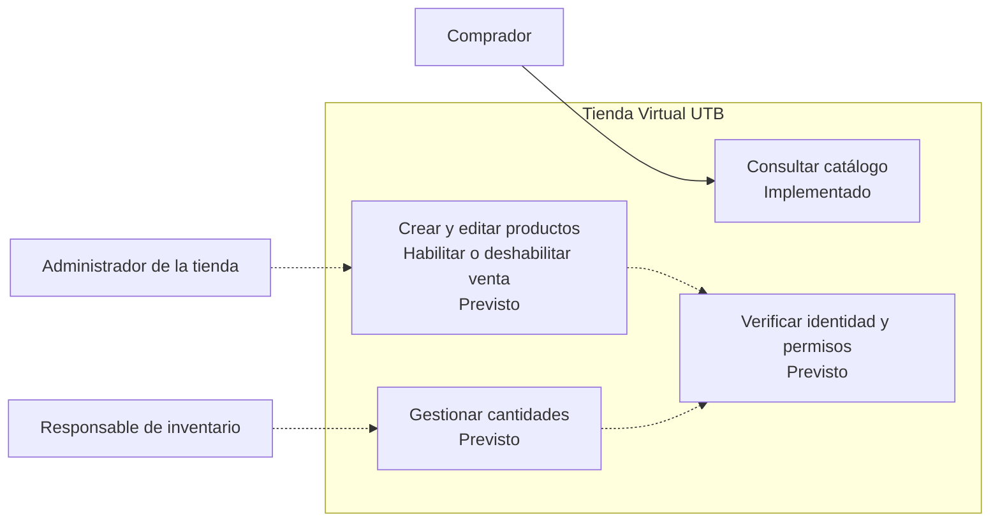
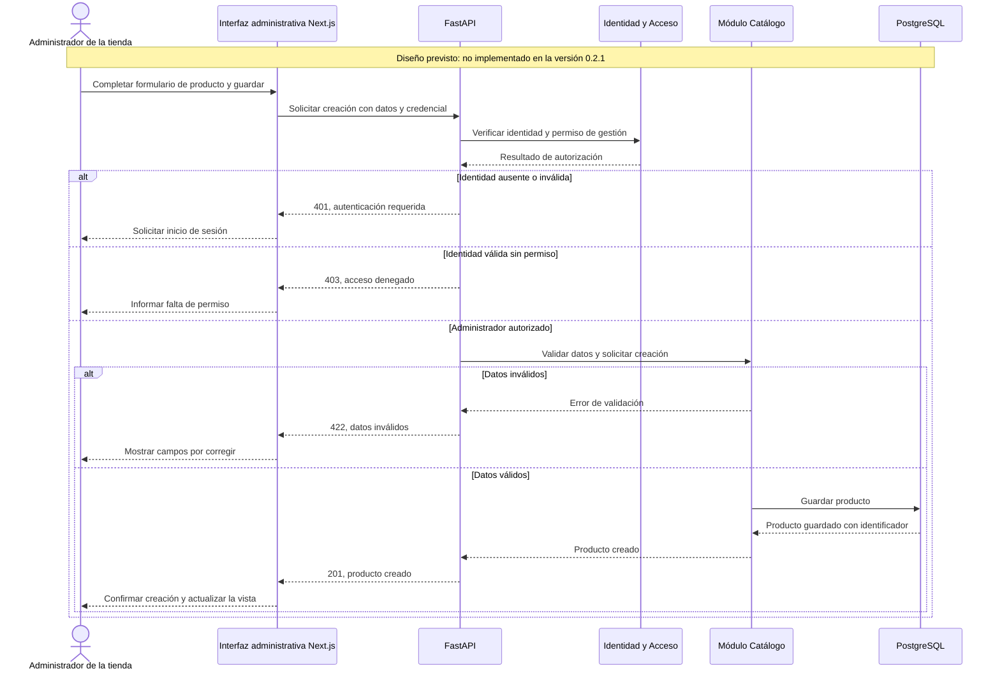

# S7: administrador de la tienda y gestión del catálogo

**Estado:** diseño documentado, pendiente de implementación. Esta ampliación
incorpora al administrador en la explicación de la integración. El
[contrato ejecutable actual](openapi.json), versión `0.2.1`, cubre las
operaciones implementadas: `GET /catalog/products`, `GET /health`,
`GET /health/ready` y `GET /metrics`.

## Actores y responsabilidades

| Actor | Responsabilidad | Módulo responsable |
|---|---|---|
| Comprador | Consultar los productos que se ofrecen en la tienda. | Catálogo |
| Administrador de la tienda | Registrar productos nuevos, editar nombre, descripción y precio, y habilitar o deshabilitar su venta. | Catálogo, con autorización de Identidad y Acceso |
| Responsable de inventario | Registrar y ajustar las cantidades de productos disponibles. | Inventario, con autorización de Identidad y Acceso |

El administrador gestiona datos **mediante la interfaz de la tienda**. El
backend valida sus permisos y aplica las reglas antes de guardar cambios.
Administrar productos no requiere acceso directo a PostgreSQL. El administrador
de base de datos (DBA) tiene una función técnica distinta: respaldos, permisos
de infraestructura y mantenimiento; no participa en este flujo de negocio.

Una persona puede desempeñar los roles de administrador de tienda y responsable
de inventario si se le asignan ambos permisos. Las responsabilidades permanecen
separadas según el [mapa de contextos](../bounded-contexts.md).

## Diagrama de actores y capacidades

Las flechas continuas representan el uso implementado; las discontinuas,
capacidades previstas. El comprador puede consultar el catálogo actual sin
autenticarse. La gestión administrativa deberá exigir identidad y permisos
verificados por el backend en cada operación.

## Flujo previsto: registrar un producto nuevo

**Precondición del diseño:** el administrador inició sesión. El mecanismo
concreto de autenticación todavía debe definirse e implementarse.

La actualización de un producto seguirá el mismo control de identidad y
permisos, verificando además que el identificador exista. Solo se confirmará
el éxito después de guardar el cambio. Los códigos del diagrama son parte del
diseño propuesto; aún no están declarados por operaciones administrativas en OpenAPI.

## Operaciones propuestas para una ampliación del contrato

Esta tabla es una propuesta de diseño, no un listado de rutas disponibles.
La definición final deberá incorporarse a OpenAPI junto con su implementación.

| Operación propuesta | Uso | Datos previstos | Respuesta prevista |
|---|---|---|---|
| `POST /catalog/products` | Registrar un producto. | `nombre`, `descripcion`, `precio_centavos`, `activo`. | `201` con el producto y su `id`. |
| `PATCH /catalog/products/{id}` | Editar un producto o habilitar/deshabilitar su venta. | Uno o varios de los campos editables anteriores. | `200` con el producto actualizado; `404` si no existe. |

Ambas operaciones requerirán permiso de administración del catálogo. Se deberán
documentar los errores `401`, `403` y `422`, sus cuerpos y el esquema de seguridad
elegido. El backend asignará el `id`. También deberán definirse restricciones de
campos, como nombre no vacío y precio no negativo, y el rechazo de campos no editables.

### Producto habilitado y unidades disponibles

- **`activo` (propuesto):** indica si el administrador habilitó el producto para
  su venta. Este campo aún no existe en el modelo ni en el contrato actual.
- **`existencias` (actual):** indica cuántas unidades hay. Su propiedad corresponde
  al módulo Inventario, aunque hoy se almacena en Catálogo; esa deuda está
  registrada en [las violaciones de S6](../violaciones-s6.md).
- Un producto nuevo no implica que haya unidades recibidas. Se propone que
  Inventario registre las cantidades por separado, y que el alta no permita
  introducir existencias mediante el contrato de Catálogo.
- Para la futura vista de compradores se propone mostrar los productos activos
  e indicar cuáles están agotados. La vista administrativa deberá permitir
  consultar también los inactivos. Los filtros y permisos de esas consultas se
  definirán al ampliar el contrato; el `GET` actual no implementa esa distinción.

## Qué falta para que sea una funcionalidad entregable

1. Implementar identidad y autorización por rol, además de la interfaz administrativa.
2. Incorporar las operaciones de escritura y la persistencia del estado `activo`.
3. Definir la integración con Inventario respetando la propiedad de sus datos.
4. Actualizar la versión y exportar OpenAPI con entradas, respuestas y seguridad.
5. Ampliar las pruebas para creación, edición, permisos, validación y persistencia,
   además de verificar los nuevos cuerpos HTTP contra el contrato en el pipeline.

Esta corrección documental no acredita esos puntos como implementados o probados.
La [guía del contrato actual](contrato-api.md) describe la API que sí existe.
