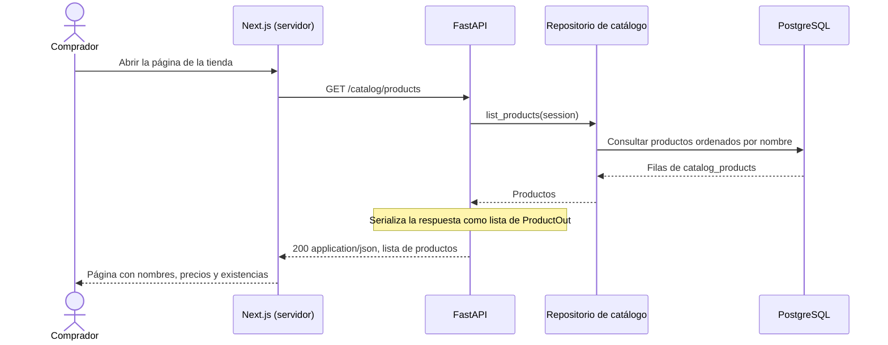
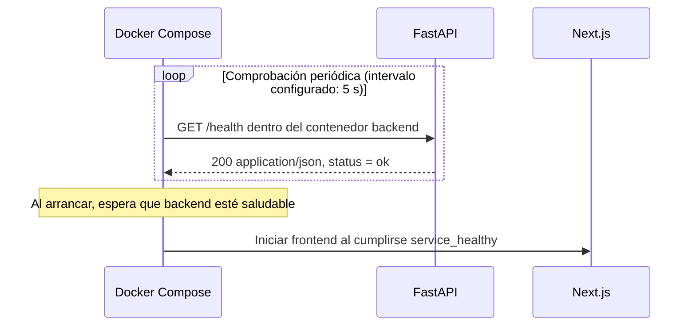

# Contrato de la API de Tienda Virtual UTB

Esta guía explica el [contrato OpenAPI guardado](openapi.json) y su relación con
la implementación. La decisión de integración está en el
[ADR 0002](../adr/0002-contrato-integracion-http.md); los comandos de pruebas y
actualización están en la [guía de evidencia](README.md).

## 1. Alcance y acceso

| Aspecto | Valor actual |
|---|---|
| Versión de la API (`info.version`) | `0.2.0` |
| Versión del formato de especificación (`openapi`) | `3.1.0` |
| Comunicación | HTTP síncrono, respuestas JSON |
| Dirección local con Docker Compose | `http://localhost:8000` |
| Dirección usada por Next.js dentro de Compose | `http://backend:8000` |
| Autenticación | Las dos operaciones actuales no requieren credenciales. |
| Documentación interactiva con la API encendida | `http://localhost:8000/docs` |
| Especificación generada por la aplicación encendida | `http://localhost:8000/openapi.json` |

`0.2.0` identifica la versión de nuestra API; `3.1.0` identifica el formato
OpenAPI utilizado para describirla. Las direcciones anteriores corresponden
al entorno local; el contrato no declara una sección `servers`.

Un **endpoint** es una operación accesible mediante un método HTTP y una ruta.
`GET` indica una consulta. Estas dos operaciones no reciben parámetros de ruta,
parámetros de consulta ni cuerpo de petición.

## 2. Diagrama de la consulta del catálogo

Este flujo corresponde al comprador que consulta productos. El administrador
de la tienda tiene un [flujo de gestión propio, documentado como diseño previsto](administracion-catalogo.md),
para registrar productos nuevos, editar sus datos y habilitar su venta.

[Descargar imagen para presentación](images/consulta-catalogo-presentacion.png).



El diagrama representa el caso exitoso en Docker Compose. Next.js realiza la
consulta desde el servidor y utiliza los datos para renderizar la página.
Si la consulta falla, la vista muestra un mensaje de error. En las pruebas
locales del backend se usa SQLite en memoria en lugar de PostgreSQL.

## 3. Consultar productos: `GET /catalog/products`

**Propósito:** obtener el catálogo completo. La implementación actual lo ordena
por `nombre`; no implementa paginación ni filtros.

Petición de ejemplo desde PowerShell:

```powershell
Invoke-RestMethod -Uri 'http://localhost:8000/catalog/products' -Method Get
```

**Respuesta documentada:** código HTTP `200` y `Content-Type: application/json`.
El cuerpo es un arreglo de objetos `ProductOut`. Este ejemplo muestra un solo
producto; los datos y la cantidad de productos pueden variar:

```json
[
  {
    "id": 1,
    "nombre": "Café americano",
    "descripcion": "Vaso de 8 oz",
    "precio_centavos": 350000,
    "existencias": 40
  }
]
```

### Campos de `ProductOut`

| Campo | Tipo en OpenAPI | Obligatorio | Significado |
|---|---|---|---|
| `id` | `integer` | Sí | Identificador del producto. |
| `nombre` | `string` | Sí | Nombre mostrado en el catálogo. |
| `descripcion` | `string` | Sí | Descripción del producto. |
| `precio_centavos` | `integer` | Sí | Precio en centavos de COP, según la interpretación del frontend. `350000` equivale a 3500 pesos. |
| `existencias` | `integer` | Sí | Cantidad registrada en el catálogo actual. |

El contrato exige estos campos y tipos, y no admite `null` en ellos. Actualmente
no fija valores mínimos, longitudes de texto ni una cantidad mínima de productos;
por tanto, `[]` es una respuesta válida. Tampoco prohíbe propiedades adicionales.
El orden por nombre y la interpretación monetaria son comportamientos del código
actual, no restricciones expresadas por el esquema OpenAPI.

Ejemplos de incumplimiento: omitir `nombre`, enviar `precio_centavos` como
`"350000"` (texto) o devolver un objeto en lugar del arreglo.

## 4. Comprobar la API: `GET /health`

**Propósito:** comprobar que el proceso de FastAPI puede atender esta petición
HTTP. Es una comprobación básica de funcionamiento, también llamada *liveness*.

- **`GET`:** método HTTP para consultar.
- **`/health`:** ruta elegida para consultar el estado del proceso; *health*
  significa «salud».
- **`200`:** la petición se atendió correctamente.
- **`{"status":"ok"}`:** cuerpo que devuelve la función de salud.

Petición de ejemplo desde PowerShell:

```powershell
Invoke-RestMethod -Uri 'http://localhost:8000/health' -Method Get
```

Respuesta documentada: `200 application/json`.

```json
{
  "status": "ok"
}
```

| Campo | Tipo | Obligatorio | Restricción |
|---|---|---|---|
| `status` | `string` | Sí | Debe ser exactamente `"ok"`, declarado mediante `const` en `HealthOut`. |

### Uso real en Docker Compose



En [`compose.yaml`](../../compose.yaml), el chequeo tiene un intervalo de
5 segundos, un tiempo límite de 5 segundos y 10 intentos fallidos antes de
considerar el contenedor no saludable. El comando usa `urllib.request.urlopen`:
comprueba que la petición termine sin error; no valida el cuerpo JSON.
Las pruebas de contrato sí comprueban ese cuerpo.

### Qué permite concluir y qué queda fuera

Una respuesta correcta confirma que se pudo contactar la API y ejecutar esa
función. La función no consulta la base de datos ni comprueba catálogo, frontend
o servicios externos. Por ejemplo, si PostgreSQL deja de responder después del
arranque, `/health` podría seguir devolviendo `200` mientras la consulta del
catálogo falla. Durante el arranque, en cambio, la aplicación sí necesita
preparar las tablas y los datos antes de atender solicitudes.

Una comprobación de **preparación para atender operaciones** (*readiness*)
incluiría las dependencias necesarias. Ese endpoint adicional no está implementado.
El chequeo actual tampoco reinicia automáticamente el backend ni garantiza la
disponibilidad permanente del sistema; la dependencia del frontend en Compose
se usa para ordenar su arranque.

## 5. Errores y límites del contrato

La especificación guardada solo declara respuestas `200` para estas operaciones.
Pueden ocurrir fallos de conexión o errores del servidor, pero todavía no existe
un esquema contractual de errores de negocio. No debe interpretarse que cada
petición siempre tendrá éxito ni que `/health` devuelve un estado `error`:
esa variante no está definida.

No se incluyen operaciones de creación de pedidos, autenticación ni modificación
de inventario. La [gestión administrativa del catálogo](administracion-catalogo.md)
se documenta como diseño previsto y tampoco forma parte del contrato ejecutable.
Estas operaciones se incorporarán a OpenAPI cuando se implementen y prueben.

## 6. Cómo se mantiene el acuerdo

El archivo `openapi.json` es la referencia guardada para revisión y control de
versiones. Las pruebas verifican su validez, su igualdad con la especificación
generada por FastAPI y las respuestas HTTP de ambas rutas. Dos casos negativos
demuestran que el esquema rechaza la ausencia de `nombre` y un precio como texto.

GitHub Actions ejecuta esas pruebas en cada `push` y `pull_request`; un
incumplimiento hace fallar el paso. El equipo debe revisar compatibilidad y
actualizar explícitamente el contrato según el [ADR 0002](../adr/0002-contrato-integracion-http.md).
La guía es explicativa: ante un cambio deben revisarse juntos código, contrato,
pruebas y este documento.
