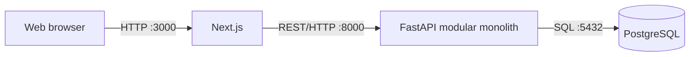
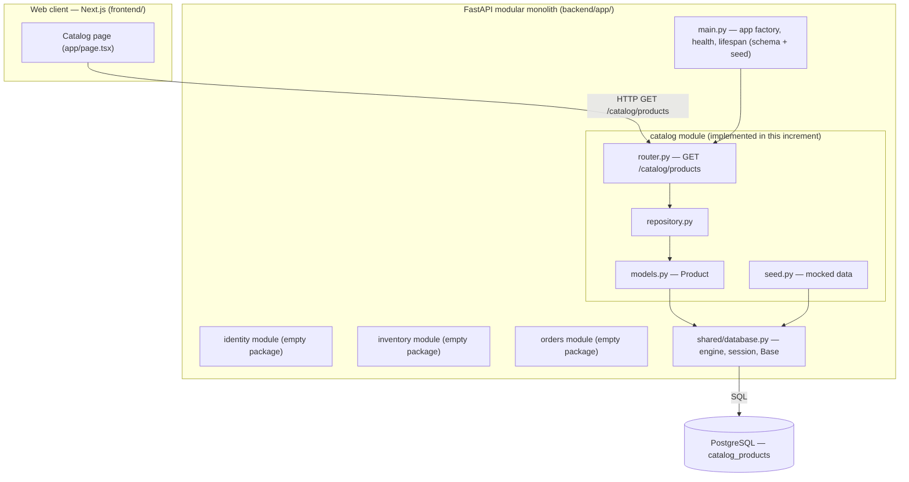
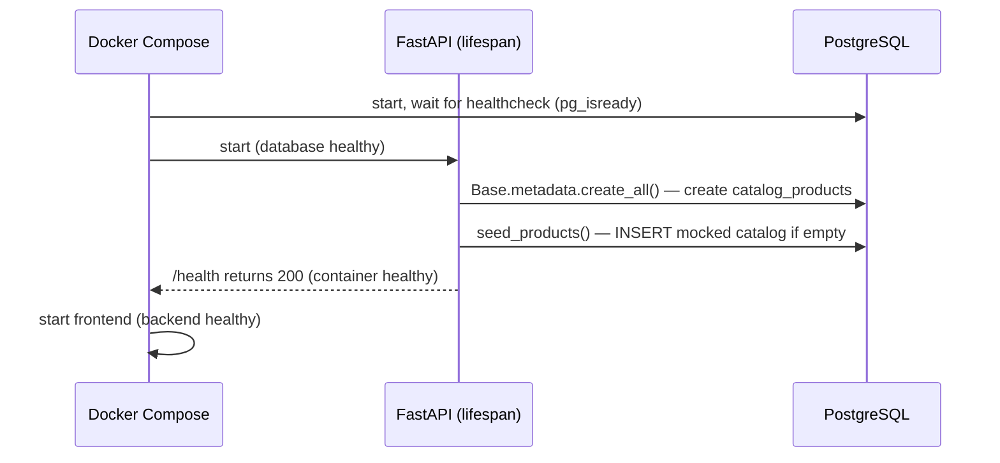
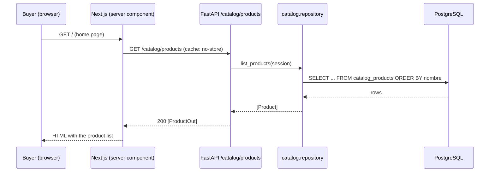
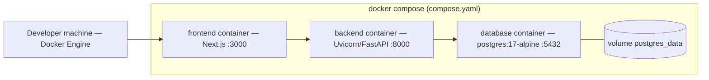

# 

**About arc42**

arc42, the template for documentation of software and system
architecture.

Template Version 9.0-EN. (based upon AsciiDoc version), July 2025

Created, maintained and © by Dr. Peter Hruschka, Dr. Gernot Starke and
contributors. See <https://arc42.org>.

# Introduction and Goals {#section-introduction-and-goals}

## Requirements Overview {#_requirements_overview}

Tienda Virtual UTB is a web system that centralizes the catalog and the
basic purchase process for the cafeteria of Universidad Tecnológica de
Bolívar. Today this information is managed manually and is dispersed,
which forces buyers to visit a point of sale to find out whether a
product is available.

In scope for the current phase:

- Browsing and searching the product catalog.
- Managing a shopping cart.
- Creating and consulting orders.
- Catalog administration (products, prices) by authorized staff.
- Basic inventory tracking (available stock).

Explicitly out of scope for this phase (see [Architecture
Constraints](#section-architecture-constraints)):

- Online payment gateway integration — orders are created in the
  system, but payment is coordinated outside of it.
- Native mobile application.
- Third-party sales.
- National shipping.
- AI-based product recommendations.
- Simultaneous integration with multiple payment gateways.
- Real data source integration — the system runs on mocked/seed
  catalog, inventory and order data, not on a live feed from the
  cafeteria or the university.

## Quality Goals {#_quality_goals}

| # | Quality Goal | Motivation |
| --- | --- | --- |
| 1 | Security | Only authenticated users should access the system, and each role (buyer, store admin, inventory manager) should only be able to perform the operations that correspond to it. |
| 2 | Usability | Buying a product should take few steps; adding authentication and role checks must not turn the purchase flow into a tedious process. |
| 3 | Performance | Stock changes triggered by a purchase should be reflected quickly enough that two buyers do not both believe the same unit of an out-of-stock product is available. |
| 4 | Availability | The catalog should stay reachable during peak consultation times (e.g. lunch hour), since that is when most of the community is expected to use it. |

These four goals are the same ones expanded into the utility tree and
quality scenarios in `docs/arbol-utilidad.md` and
`docs/escenarios-calidad.md`.

## Stakeholders {#_stakeholders}

| Role | Who | Expectations |
| --- | --- | --- |
| Buyer (*Comprador*) | Students, professors, staff and alumni of UTB | Quickly find out what is available, buy with few steps, and check the status of their order. |
| Store administrator (*Administrador*) | Authorized cafeteria staff | Register/update products and prices, and manage order status. |
| Inventory manager (*Responsable de inventario*) | Authorized cafeteria staff | Consult and update available stock so it matches what buyers see in the catalog. |

# Architecture Constraints {#section-architecture-constraints}

| Constraint | Type | Justification |
| --- | --- | --- |
| Fixed stack: FastAPI (backend), Next.js (frontend), PostgreSQL (database) | Technical | Early team decision to keep the same stack across every course deliverable and avoid re-architecting the project each evidence. |
| Mocked/seed data only, no real integration with the cafeteria or university systems in this phase | Scope | There is no confirmed access to a real inventory/sales system of the cafeteria yet; mocked data lets the team validate catalog, cart and inventory flows without depending on that integration. |
| No online payment gateway in this phase | Scope | Gateway availability and institutional restrictions are not confirmed yet (see `docs/disponibilidad.md`); the catalog/order flow is prioritized first. |
| Own authentication, no institutional SSO | Organizational | Access to the university's institutional authentication infrastructure has not been confirmed at this point. |
| Deployment environment still to be confirmed | Infrastructure | Depends on which free/academic service ends up being authorized; left open so it does not block the rest of this deliverable. |
| No native mobile app, third-party sales, national shipping, AI recommendations, or multiple simultaneous payment gateways | Scope | Explicit exclusions from `docs/problema.md` to keep the initial scope manageable for a 4-person team within the course schedule. |

# Context and Scope {#section-context-and-scope}

## Business Context {#_business_context}

See the C4 context diagram in
[`docs/c4/context.md`](../c4/context.md).

- **Buyer** — browses/searches the catalog, manages a cart, creates
  and consults their own orders.
- **Store administrator** — registers/updates products and prices,
  and manages order status.
- **Inventory manager** — consults and updates available stock.

There are no external domain interfaces in this phase: no payment
provider and no institutional authentication system are integrated
yet (see Architecture Constraints above).

## Technical Context {#_technical_context}

| Channel | Technology | Notes |
| --- | --- | --- |
| Web client | Next.js | Used by buyers, administrators and inventory managers through role-based views. |
| API | FastAPI (REST over HTTP) | Exposes catalog, cart, order and inventory operations to the Next.js client. |
| Data storage | PostgreSQL | Currently seeded with mocked catalog, inventory and order data; not yet fed by a real cafeteria system. |

No external systems (payment gateway, institutional SSO) are part of
the technical context yet; they are anticipated extension points, not
current dependencies.

# Solution Strategy {#section-solution-strategy}

The solution uses a **modular monolith** for the FastAPI backend. It keeps the
initial deployment simple while making the boundaries between identity,
catalog, inventory and orders explicit. The rationale, alternatives and
consequences are recorded in
[`ADR 0001`](../adr/0001-monolito-modular.md), supported by the
[`architecture comparison matrix`](../matriz-comparativa-arquitectura.md).

## Fundamental decisions

| Decision | Approach | Contribution |
| --- | --- | --- |
| System structure | A Next.js web client and one modular FastAPI backend, backed by one PostgreSQL instance | Avoids distributed-system overhead while preserving functional boundaries |
| Backend decomposition | Packages for identity, catalog, inventory and orders, plus a restricted shared package | Aligns the code with the business capabilities and role boundaries |
| Communication | REST over HTTP between Next.js and FastAPI; explicit public interfaces or internal events for future cross-module collaboration | Keeps integration understandable and prevents imports of another module's internals |
| Data | One PostgreSQL instance for the current phase; data ownership will be assigned to modules when persistence is implemented | Supports consistency of orders and stock without premature distribution |
| Execution environment | Docker Compose starts the web client, API and database as one reproducible local environment | Reduces setup differences between team members and demonstrations |
| Evolution | Keep a single deployable until measured scaling or organizational needs justify extracting a module | Preserves a path to change without paying the cost of microservices now |

## Relationship to quality goals

- **Security:** identity and authorization have their own module, and other
  modules must not bypass its future public contract.
- **Usability:** Next.js remains an independent web client so the purchase flow
  can evolve without mixing presentation concerns into backend modules.
- **Performance:** a single backend and database avoid network hops in the
  initial stock-update flow.
- **Availability:** one-command startup and explicit health checks make the
  academic/demo environment repeatable. Production availability guarantees are
  not claimed at this stage.

## Initial deployment shape

This increment adds one **vertical slice** on top of that skeleton — *browse
the product catalog* — implemented end to end (Next.js page → FastAPI
`GET /catalog/products` → SQLAlchemy → PostgreSQL, seeded with mocked data).
The remaining modules (identity, inventory, orders) stay as empty packages and
are deferred to later increments.

# Building Block View {#section-building-block-view}

## Whitebox Overall System {#_whitebox_overall_system}

**Motivation.** The decomposition follows the business capabilities named in
`ADR 0001`: the code structure mirrors identity, catalog, inventory and orders,
so the modules that will hold role boundaries are visible from the start.

Contained building blocks:

| Building block | Responsibility | Location |
| --- | --- | --- |
| Web client | Server-rendered catalog view; formats prices and stock | `frontend/app/` |
| API entry point | Creates the FastAPI app, exposes `/health`, creates the schema and seeds mocked data on startup | `backend/app/main.py` |
| `catalog` module | Owns the `Product` table and the `/catalog/products` endpoint | `backend/app/modules/catalog/` |
| `identity` / `inventory` / `orders` modules | Reserved packages for later increments; currently empty | `backend/app/modules/` |
| `shared` | Transversal DB access only (engine, session, declarative base) — no business logic, per ADR 0001 | `backend/app/shared/database.py` |
| Database | Single PostgreSQL instance; the `catalog_products` table is owned by the `catalog` module | container `database` in `compose.yaml` |

Important interfaces:

- **`GET /catalog/products`** — returns a JSON array of
  `{id, nombre, descripcion, precio_centavos, existencias}` ordered by name.
  Documented at runtime under `/docs` (OpenAPI).
- **`GET /health`** — liveness probe used by the Docker Compose healthcheck.

## Level 2 {#_level_2}

### White Box *catalog module* {#_white_box_building_block_1}

The only module with behaviour in this increment. It keeps a thin layered shape
inside the module boundary:

| Element | Responsibility |
| --- | --- |
| `router.py` | HTTP surface: declares `GET /catalog/products`, injects a DB session via `Depends(get_session)`, maps rows to `ProductOut`. |
| `schemas.py` | `ProductOut` — the module's public data contract (Pydantic). |
| `repository.py` | `list_products(session)` — the only place that builds catalog queries. |
| `models.py` | `Product` ORM mapping to `catalog_products`; the module owns this table. |
| `seed.py` | `seed_products(session)` — idempotent insertion of the mocked catalog (only if the table is empty). |

Dependency rules (from ADR 0001) respected here: the module imports from
`app.shared.database` (allowed, transversal) and from nothing inside
`identity`, `inventory` or `orders`.

### White Box *shared/database* {#_white_box_building_block_2}

`shared/database.py` exposes exactly three things: `engine`, `SessionLocal`
(via `get_session` dependency) and `Base`. The database URL comes from the
`DATABASE_URL` environment variable (PostgreSQL in Docker Compose), falling
back to an in-memory SQLite database for the test suite. No module-specific
model or query lives here.

# Runtime View {#section-runtime-view}

## Startup — schema and seed {#_runtime_scenario_1}

Notable aspects: seeding is **idempotent** — on a restart with an existing
volume the table is already populated and `seed_products` returns without
writing. Ordering between containers is enforced by Compose `depends_on` +
healthchecks, not by retry logic in the code.

## Browsing the catalog {#_runtime_scenario_2}

Notable aspects: the page is rendered on the server, so the browser never calls
the API directly; `cache: "no-store"` makes the route dynamic so stock changes
are reflected on the next request. If the API is unreachable the page renders an
error message instead of failing the whole response.

# Deployment View {#section-deployment-view}

## Infrastructure Level 1 {#_infrastructure_level_1}

**Motivation.** A single `docker compose up --build` must bring up the whole
system reproducibly on any team member's machine for development and demos. No
cloud environment is committed yet (see Architecture Constraints).

Mapping of building blocks to infrastructure:

| Building block | Container | Image / build | Ports |
| --- | --- | --- | --- |
| Web client | `frontend` | build `./frontend` (node:22-alpine) | 3000 |
| API (modular monolith) | `backend` | build `./backend` (python:3.12-slim) | 8000 |
| Database | `database` | `postgres:17-alpine` | 5432 (internal) |
| Persistent data | volume `postgres_data` | — | — |

Quality features: healthchecks on `database` (`pg_isready`) and `backend`
(`/health`) plus `depends_on: condition: service_healthy` guarantee start-up
order; the named volume preserves local data across restarts.

# Cross-cutting Concepts {#section-concepts}

## Persistence and data ownership {#_concept_1}

One PostgreSQL instance, one SQLAlchemy `Base`. Each module declares and owns
its own tables (`catalog` owns `catalog_products`); other modules must go
through the owning module's public interface, never its ORM models. The schema
is created at startup with `create_all` — migrations (Alembic) are deferred
until the schema stabilises.

## Configuration {#_concept_2}

Configuration is read from environment variables set in `compose.yaml`
(`DATABASE_URL` for the API, `API_URL` for the web client). Code ships with
safe local defaults so the test suite runs with no environment set.

## Mocked data {#_concept_3}

Per the constraints, there is no real data source. Seed data lives in the
owning module (`catalog/seed.py`) and is inserted idempotently on startup, so
the running system always has a catalog to show without a manual step.

## Testing {#_concept_4}

Tests run against in-memory SQLite (no container needed) and cover: the health
route, the ADR module boundaries, and the catalog endpoint (contract, ordering,
seeded content). GitHub Actions runs the same suite on every push and PR.

# Architecture Decisions {#section-design-decisions}

| ADR | Decision | Status |
| --- | --- | --- |
| [0001](../adr/0001-monolito-modular.md) | Modular monolith for the FastAPI backend, split into `identity`, `catalog`, `inventory`, `orders` + a restricted `shared` package, with explicit inter-module dependency rules | Accepted (2026-08-21) |

Decisions still open (candidates for future ADRs): authentication mechanism,
adoption of database migrations, whether any module adopts a hexagonal shape
internally, and the deployment target.

# Quality Requirements {#section-quality-scenarios}

## Quality Requirements Overview {#_quality_requirements_overview}

The utility tree (`docs/arbol-utilidad.md`) prioritises leaves along two axes,
business impact (IN) and architectural risk (RA). The highest-priority leaves
(IN: H) are role-based authorization, the minimal-steps purchase flow, and
stock becoming visible to other users shortly after an order.

## Quality Scenarios {#_quality_scenarios}

Full scenarios (Source / Stimulus / Environment / Artifact / Response /
Response measure) are in `docs/escenarios-calidad.md`. Summary:

| # | Quality goal | Scenario | Response measure | Covered in this increment |
| --- | --- | --- | --- | --- |
| 1 | Security | An inventory manager tries to change a product price | 100% of the defined out-of-role operations are rejected (403) | No — needs the `identity` module |
| 2 | Usability | A buyer completes a purchase | Flow completed in ≤ 4 screens/steps | Partially — catalog view exists; cart/checkout pending |
| 3 | Performance | An order reduces a product's stock | Change visible to another session in < 2 s on reload | Enabler in place — dynamic (`no-store`) catalog read; order flow pending |
| 4 | Availability | ~5 concurrent buyers browse the catalog | All get a correct response, local server stays up | Testable now — `GET /catalog/products` is live |

# Risks and Technical Debts {#section-technical-risks}

| Risk / debt | Impact | Current mitigation |
| --- | --- | --- |
| Module boundaries are convention-based, not enforced by the network | Undesired coupling between modules | ADR dependency rules + `test_architecture.py`; stricter dependency test planned when more code exists |
| `create_all` instead of migrations | Schema changes on populated databases will be manual | Acceptable while the schema is small; Alembic ADR pending |
| Deployment target not chosen | Cannot demo outside a local machine | System runs fully with one Compose command; target to be confirmed (`docs/disponibilidad.md`) |
| Mocked data only | Behaviour not validated against real cafeteria data | Explicit scope constraint; seed data models realistic products |
| `next@15.5.2` has a known CVE | Security exposure in the web client | Noted; upgrade to a patched Next.js release is a follow-up task |

# Glossary {#section-glossary}

| Term | Definition |
| --- | --- |
| Buyer (*Comprador*) | UTB student, professor, staff member or alumnus who browses the catalog and places/consults orders. |
| Store administrator (*Administrador*) | Authorized cafeteria staff who manages products, prices and order status. |
| Inventory manager (*Responsable de inventario*) | Authorized cafeteria staff who consults and updates available stock. |
| Catalog | Set of products offered by the cafeteria, with description, price and available stock. |
| Modular monolith | A single deployable backend divided into modules with explicit boundaries by business capability (see ADR 0001). |
| Module | A backend package for one business capability (`identity`, `catalog`, `inventory`, `orders`); owns its tables and public contract. |
| `shared` | Package for genuinely transversal code only (currently database access); never a home for a module's logic. |
| Vertical slice | A single feature implemented through every layer (web → API → persistence) rather than one layer at a time. |
| Seed / mocked data | Example data inserted automatically so the system is usable without a real integration. |
| `precio_centavos` | Product price stored as an integer number of cents (COP) to avoid floating-point rounding. |
| ADR | Architecture Decision Record — a short document capturing one decision, its context and consequences. |
| C4 | Model for visualising software architecture at four zoom levels: Context, Container, Component, Code. |
| Health check | `GET /health` endpoint used by Docker Compose to decide when a container is ready. |
