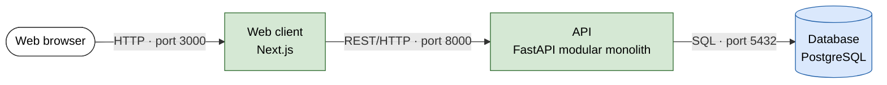
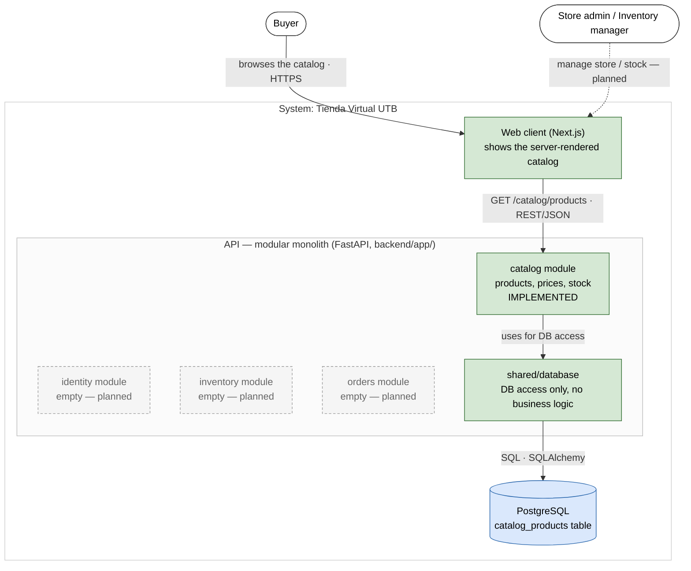
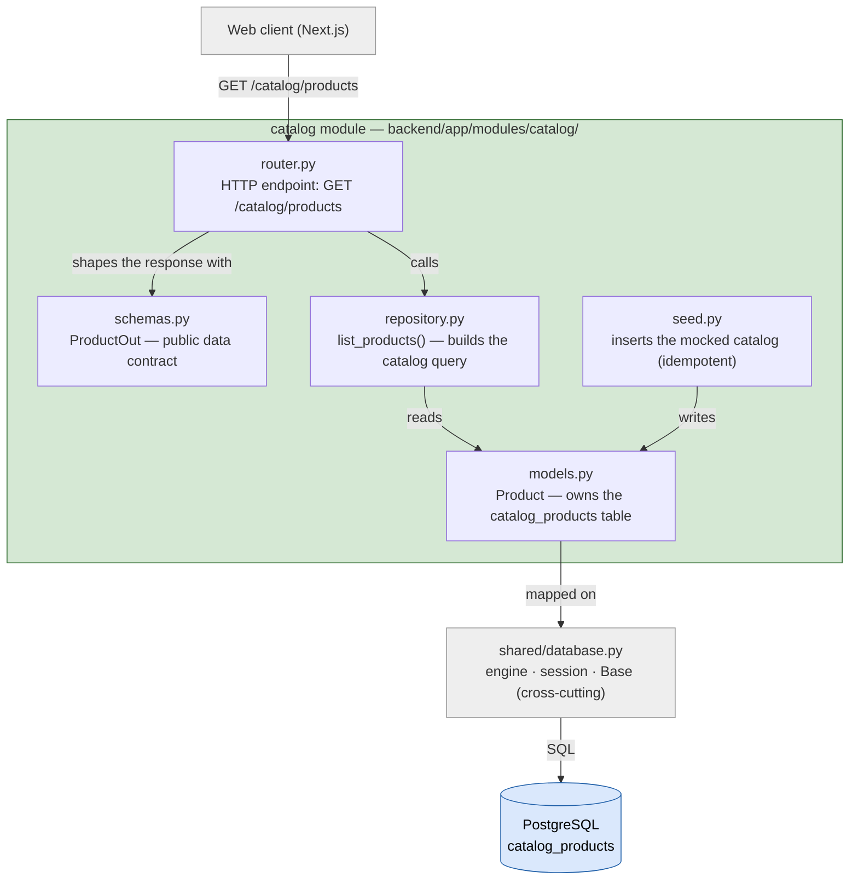
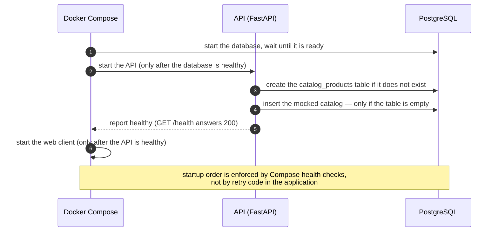
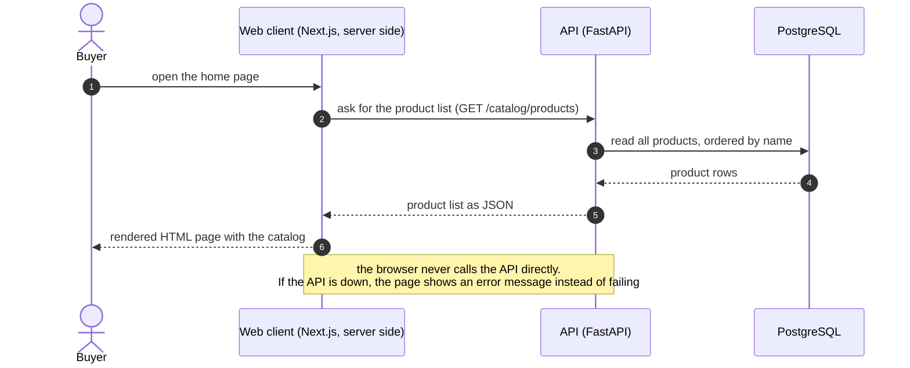
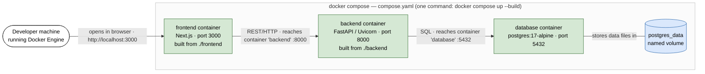

# 

**About arc42**

arc42, the template for documentation of software and system
architecture.

Template Version 9.0-EN. (based upon AsciiDoc version), July 2025

Created, maintained and © by Dr. Peter Hruschka, Dr. Gernot Starke and
contributors. See <https://arc42.org>.

## Diagram conventions {#_diagram_conventions}

These conventions apply to every figure in this document, so they are stated
once here instead of being repeated under each diagram:

- **Author / date:** all diagrams are maintained by the Tienda Virtual UTB team
  and were last revised on 2026-08-31. They are versioned as text (Mermaid)
  together with the code; change history and the commit that introduced each
  change are in the git log.
- **Notation:**
  - C4 diagrams (`docs/c4/context.md`, `docs/c4/container.md`) follow the
    [C4 model](https://c4model.com) notation: a *Person* is a human role, the
    highlighted box is the system in scope, and every arrow is a one-way
    relationship labelled with its purpose and — from level 2 on — its protocol.
  - Diagrams inside this document are Mermaid `flowchart` and `sequenceDiagram`,
    **not** C4 notation.
- **Colour and shape legend (this document's flowcharts):**
  | Appearance | Meaning |
  | --- | --- |
  | Green box | Building block **implemented** in this increment |
  | Grey dashed box | Package **reserved, not built yet** |
  | Blue cylinder | Datastore (a database or table) |
  | White rounded box | A human role (actor) |
  | Grey box | An element shown only for context (lives outside the boundary drawn) |
  | Box inside a box (`subgraph`) | A boundary: the outer box contains the inner ones |
  | Arrow `A --> B` labelled *x* | A uses / calls / sends *x* to B (one direction only) |
- **Scope:** each figure states below it what it deliberately leaves out.
- **Traceability:** structural decisions behind the diagrams are recorded in
  [`ADR 0001`](../adr/0001-monolito-modular.md).

# Introduction and Goals {#section-introduction-and-goals}

## Requirements Overview {#_requirements_overview}

Tienda Virtual UTB is a web system that centralizes the catalog and the
basic purchase process for the cafeteria of Universidad Tecnológica de
Bolívar. Today this information is managed manually and is dispersed,
which forces buyers to visit a point of sale to find out whether a
product is available.

In scope for the current phase:

- Browsing and searching the product catalog.
- Managing a shopping cart.
- Creating and consulting orders.
- Catalog administration (products, prices) by authorized staff.
- Basic inventory tracking (available stock).

Explicitly out of scope for this phase (see [Architecture
Constraints](#section-architecture-constraints)):

- Online payment gateway integration — orders are created in the
  system, but payment is coordinated outside of it.
- Native mobile application.
- Third-party sales.
- National shipping.
- AI-based product recommendations.
- Simultaneous integration with multiple payment gateways.
- Real data source integration — the system runs on mocked/seed
  catalog, inventory and order data, not on a live feed from the
  cafeteria or the university.

## Business Goals {#_business_goals}

What the system is meant to achieve for the organization, independently of how it
is built. These goals are derived from `docs/problema.md` (sections *Contexto y
problema* and *Resultado esperado*); the last column names who the goal belongs
to, so that every later decision can be traced back to someone's interest.

| # | Business goal | Why it matters | Primary stakeholder |
| --- | --- | --- | --- |
| BG-1 | Centralize the catalog, prices and availability of the cafeteria in a single web system | Today this information is handled manually and is dispersed, so nobody has a single reliable view of what is on offer | Store administrator |
| BG-2 | Let a buyer find out whether a product is available **before** walking to a point of sale | Avoids the wasted trip and the queue, which is the everyday frustration that motivates the project | Buyer |
| BG-3 | Reduce the manual work needed to keep catalog, stock and order status up to date | Manual upkeep does not scale with the cafeteria's activity and is where errors appear | Store administrator, inventory manager |
| BG-4 | Make the browsing and purchase process traceable: orders are recorded and can be consulted afterwards | Both sides need to be able to answer "what was ordered, and in what state is it" without asking in person | Buyer, store administrator |

## Quality Goals {#_quality_goals}

Each quality goal exists to serve at least one business goal. The *Supports*
column is that link, and *Stakeholder who cares most* names who loses out if the
goal is missed.

| # | Quality Goal | Motivation | Supports | Stakeholder who cares most |
| --- | --- | --- | --- | --- |
| 1 | Security | Only authenticated users should access the system, and each role (buyer, store admin, inventory manager) should only be able to perform the operations that correspond to it. | BG-1, BG-3 | Store administrator — a price or stock changed by the wrong person destroys the single reliable view BG-1 promises |
| 2 | Usability | Buying a product should take few steps; adding authentication and role checks must not turn the purchase flow into a tedious process. | BG-2, BG-4 | Buyer — a flow more tedious than walking to the counter defeats the purpose of the system |
| 3 | Performance | Stock changes triggered by a purchase should be reflected quickly enough that two buyers do not both believe the same unit of an out-of-stock product is available. | BG-2 | Buyer — availability that is shown but not real is worse than no information at all |
| 4 | Availability | The catalog should stay reachable during peak consultation times (e.g. lunch hour), since that is when most of the community is expected to use it. | BG-2 | Buyer — the catalog is worth least precisely when it is needed most |

These four goals are the same ones expanded into the
[utility tree](../arbol-utilidad.md) and the
[quality scenarios](../escenarios-calidad.md).

## Stakeholders {#_stakeholders}

| Role | Who | Expectations | Business goals |
| --- | --- | --- | --- |
| Buyer (*Comprador*) | Students, professors, staff and alumni of UTB | Quickly find out what is available, buy with few steps, and check the status of their order. | BG-2 (availability known before travelling), BG-4 (own orders consultable) |
| Store administrator (*Administrador*) | Authorized cafeteria staff | Register/update products and prices, and manage order status. | BG-1 (single view of the offer), BG-3 (less manual upkeep), BG-4 (order status traceable) |
| Inventory manager (*Responsable de inventario*) | Authorized cafeteria staff | Consult and update available stock so it matches what buyers see in the catalog. | BG-3 (less manual upkeep), and feeds the stock accuracy BG-2 depends on |

# Architecture Constraints {#section-architecture-constraints}

| Constraint | Type | Justification |
| --- | --- | --- |
| Fixed stack: FastAPI (backend), Next.js (frontend), PostgreSQL (database) | Technical | Early team decision to keep the same stack across every course deliverable and avoid re-architecting the project each evidence. |
| Mocked/seed data only, no real integration with the cafeteria or university systems in this phase | Scope | There is no confirmed access to a real inventory/sales system of the cafeteria yet; mocked data lets the team validate catalog, cart and inventory flows without depending on that integration. |
| No online payment gateway in this phase | Scope | Gateway availability and institutional restrictions are not confirmed yet (see `docs/disponibilidad.md`); the catalog/order flow is prioritized first. |
| Own authentication, no institutional SSO | Organizational | Access to the university's institutional authentication infrastructure has not been confirmed at this point. |
| Deployment environment still to be confirmed | Infrastructure | Depends on which free/academic service ends up being authorized; left open so it does not block the rest of this deliverable. |
| No native mobile app, third-party sales, national shipping, AI recommendations, or multiple simultaneous payment gateways | Scope | Explicit exclusions from `docs/problema.md` to keep the initial scope manageable for a 4-person team within the course schedule. |

# Context and Scope {#section-context-and-scope}

## Business Context {#_business_context}

See the C4 context diagram in
[`docs/c4/context.md`](../c4/context.md).

- **Buyer** — browses/searches the catalog, manages a cart, creates
  and consults their own orders.
- **Store administrator** — registers/updates products and prices,
  and manages order status.
- **Inventory manager** — consults and updates available stock.

There are no external domain interfaces in this phase: no payment
provider and no institutional authentication system are integrated
yet (see Architecture Constraints above).

## Technical Context {#_technical_context}

| Channel | Technology | Notes |
| --- | --- | --- |
| Web client | Next.js | Used by buyers, administrators and inventory managers through role-based views. |
| API | FastAPI (REST over HTTP) | Exposes catalog, cart, order and inventory operations to the Next.js client. |
| Data storage | PostgreSQL | Currently seeded with mocked catalog, inventory and order data; not yet fed by a real cafeteria system. |

No external systems (payment gateway, institutional SSO) are part of
the technical context yet; they are anticipated extension points, not
current dependencies.

# Solution Strategy {#section-solution-strategy}

The solution uses a **modular monolith** for the FastAPI backend. It keeps the
initial deployment simple while making the boundaries between identity,
catalog, inventory and orders explicit. The rationale, alternatives and
consequences are recorded in
[`ADR 0001`](../adr/0001-monolito-modular.md), supported by the
[`architecture comparison matrix`](../matriz-comparativa-arquitectura.md).

## Fundamental decisions

| Decision | Approach | Contribution |
| --- | --- | --- |
| System structure | A Next.js web client and one modular FastAPI backend, backed by one PostgreSQL instance | Avoids distributed-system overhead while preserving functional boundaries |
| Backend decomposition | Packages for identity, catalog, inventory and orders, plus a restricted shared package | Aligns the code with the business capabilities and role boundaries |
| Communication | REST over HTTP between Next.js and FastAPI; explicit public interfaces or internal events for future cross-module collaboration | Keeps integration understandable and prevents imports of another module's internals |
| Data | One PostgreSQL instance for the current phase; data ownership will be assigned to modules when persistence is implemented | Supports consistency of orders and stock without premature distribution |
| Execution environment | Docker Compose starts the web client, API and database as one reproducible local environment | Reduces setup differences between team members and demonstrations |
| Evolution | Keep a single deployable until measured scaling or organizational needs justify extracting a module | Preserves a path to change without paying the cost of microservices now |

## Relationship to quality goals

The four scenarios come from the [utility tree](../arbol-utilidad.md) and are
written out in [quality scenarios](../escenarios-calidad.md); they are numbered
as in section 10 below. How each architectural style scores against them is in
the [architecture comparison matrix](../matriz-comparativa-arquitectura.md).

- **Security** (scenario 1: an out-of-role price change is rejected with 403):
  identity and authorization have their own module, sole owner of the contract,
  and other modules must not bypass its future public contract.
- **Usability** (scenario 2: a purchase completed in at most 4 screens): Next.js
  remains an independent web client so the purchase flow can evolve without
  mixing presentation concerns into backend modules.
- **Performance** (scenario 3: stock visible to another session in under 2 s): a
  single backend and database avoid network hops and eventual consistency in the
  stock-update flow.
- **Availability** (scenario 4: about 5 concurrent catalog requests): one-command
  startup and explicit health checks make the academic/demo environment
  repeatable. Production availability guarantees are not claimed at this stage.

## Initial deployment shape

*Fig. 4.1 — Initial deployment shape: the three parts of the system and how they
talk (flowchart). Scope: the logical shape only; the concrete containers, images
and volume are in Fig. 7.1.*

On top of that skeleton this increment adds one **vertical slice** —
*browse the product catalog* — implemented end to end (Next.js page → FastAPI
`GET /catalog/products` → SQLAlchemy → PostgreSQL, seeded with mocked data).
The remaining modules (identity, inventory, orders) are still empty packages
and are deferred to later increments.

# Building Block View {#section-building-block-view}

## Whitebox Overall System {#_whitebox_overall_system}

**Motivation.** The decomposition follows the business capabilities named in
`ADR 0001`: the code structure mirrors identity, catalog, inventory and orders,
so the modules that will hold the role boundaries are visible from the start.

*Fig. 5.1 — Building Block View, level 1: the whole system as a white box
(flowchart; see the colour legend under "Diagram conventions"). Top-level
building blocks: the web client, the API (with its four modules and the `shared`
package), and the database. Scope: only the `catalog` module has behaviour in
this increment; `identity`, `inventory` and `orders` are empty packages and
their internals are out of scope. The same web client, API and database appear,
in C4 container notation, in [`docs/c4/container.md`](../c4/container.md).*

Contained building blocks:

| Building block | Responsibility | Location |
| --- | --- | --- |
| Web client | Server-rendered catalog view; formats prices and stock | `frontend/app/` |
| API entry point | Creates the FastAPI application, exposes `/health`, creates the schema and seeds the mocked data at startup | `backend/app/main.py` |
| `catalog` module | Owns the `Product` table and the `/catalog/products` endpoint | `backend/app/modules/catalog/` |
| `identity`, `inventory`, `orders` modules | Packages reserved for later increments; empty today | `backend/app/modules/` |
| `shared` | Cross-cutting database access only (engine, session, declarative base); no business logic, per ADR 0001 | `backend/app/shared/database.py` |
| Database | Single PostgreSQL instance; the `catalog_products` table is owned by the `catalog` module | `database` container in `compose.yaml` |

Important interfaces:

- **`GET /catalog/products`** — returns a JSON array of
  `{id, nombre, descripcion, precio_centavos, existencias}` ordered by name.
  Documented at runtime under `/docs` (OpenAPI).
- **`GET /health`** — liveness probe used by the Docker Compose health check.

## Level 2 {#_level_2}

### White Box *catalog module* {#_white_box_building_block_1}

This is the only module with behavior in this increment. It keeps a thin
layered structure inside the module boundary:

*Fig. 5.2 — Building Block View, level 2: inside the `catalog` module
(flowchart). Grey boxes (`web`, `shared/database`, the database) are drawn only
for context — they live outside this module. Scope: the read path
`GET /catalog/products` and the startup seed; nothing from `identity`,
`inventory` or `orders`.*

| Element | Responsibility |
| --- | --- |
| `router.py` | HTTP surface: declares `GET /catalog/products`, injects a database session with `Depends(get_session)` and maps rows to `ProductOut`. |
| `schemas.py` | `ProductOut`, the module's public data contract (Pydantic). |
| `repository.py` | `list_products(session)`, the only place where catalog queries are built. |
| `models.py` | `Product`, the ORM mapping to `catalog_products`; the module owns this table. |
| `seed.py` | `seed_products(session)`, idempotent insertion of the mocked catalog (only when the table is empty). |

The dependency rules from ADR 0001 hold here: the module imports from
`app.shared.database` (allowed, because it is cross-cutting) and from nothing
inside `identity`, `inventory` or `orders`.

### White Box *shared/database* {#_white_box_building_block_2}

`shared/database.py` exposes exactly three things: `engine`, `SessionLocal`
(through the `get_session` dependency) and `Base`. The database URL comes from
the `DATABASE_URL` environment variable (PostgreSQL under Docker Compose), with
a fallback to an in-memory SQLite database for the test suite. No module-specific
model or query lives here.

# Runtime View {#section-runtime-view}

## Startup: schema and seed {#_runtime_scenario_1}

*Fig. 6.1 — Runtime scenario: system startup, schema creation and data seeding
(sequence diagram; time flows top to bottom, numbers are the step order). Scope:
container orchestration and first-run data only; handling a normal request is
Fig. 6.2.*

Notable aspects: seeding is **idempotent**; on a restart with an existing volume
the table is already populated and `seed_products` returns without writing.
Ordering between containers is enforced by Compose with `depends_on` and health
checks, not by retry logic in the code.

## Browsing the catalog {#_runtime_scenario_2}

*Fig. 6.2 — Runtime scenario: a buyer browses the catalog (sequence diagram;
time flows top to bottom). Scope: the read path only; cart, checkout and
authentication are not implemented yet.*

Notable aspects: the page is server-rendered, so the browser never calls the
API directly; `cache: "no-store"` makes the route dynamic, so stock changes are
reflected on the next request. If the API is unavailable, the page shows an
error message instead of failing the whole response.

# Deployment View {#section-deployment-view}

## Infrastructure Level 1 {#_infrastructure_level_1}

**Motivation.** A single `docker compose up --build` must bring up the whole
system reproducibly on any team member's machine, for development and
demonstrations. No cloud environment is committed yet (see Architecture
Constraints).

*Fig. 7.1 — Deployment, level 1: the local Docker Compose environment
(flowchart). Each green box is one running container; the blue cylinder is the
Docker volume that keeps the database files between restarts. Scope: the
development / demo environment only; no cloud or staging environment is defined
yet (see Architecture Constraints).*

Mapping of building blocks to infrastructure:

| Building block | Container | Image or build | Ports |
| --- | --- | --- | --- |
| Web client | `frontend` | builds `./frontend` (node:22-alpine) | 3000 |
| API (modular monolith) | `backend` | builds `./backend` (python:3.12-slim) | 8000 |
| Database | `database` | `postgres:17-alpine` | 5432 (internal) |
| Persistent data | `postgres_data` volume | — | — |

Quality features: the health checks on `database` (`pg_isready`) and `backend`
(`/health`), together with `depends_on: condition: service_healthy`, enforce
startup order; the named volume keeps local data across restarts.

# Cross-cutting Concepts {#section-concepts}

## Persistence and data ownership {#_concept_1}

One PostgreSQL instance and one SQLAlchemy `Base`. Each module declares and owns
its tables (`catalog` owns `catalog_products`); other modules must go through
the owning module's public interface, never through its ORM models. The schema
is created at startup with `create_all`; migrations (Alembic) are deferred until
the schema stabilizes.

## Configuration {#_concept_2}

Configuration is read from environment variables defined in `compose.yaml`
(`DATABASE_URL` for the API and `API_URL` for the web client). The code ships
safe defaults for the local environment, so the test suite runs without any
configuration.

## Mocked data {#_concept_3}

Per the constraints, there is no real data source. The seed data lives in the
owning module (`catalog/seed.py`) and is inserted idempotently at startup, so
the running system always has a catalog to show without any manual step.

## Testing {#_concept_4}

Tests run against in-memory SQLite (no containers needed) and cover the health
route, the ADR module boundaries and the catalog endpoint (contract, ordering
and seeded content). GitHub Actions runs the same suite on every push and pull
request.

# Architecture Decisions {#section-design-decisions}

| ADR | Decision | Status |
| --- | --- | --- |
| [0001](../adr/0001-monolito-modular.md) | Modular monolith for the FastAPI backend, split into `identity`, `catalog`, `inventory` and `orders`, plus a restricted `shared` package, with explicit inter-module dependency rules | Accepted (2026-08-21) |

Decisions still open (candidates for future ADRs): the authentication mechanism,
adopting database migrations, whether any module adopts a hexagonal shape
internally, and the deployment target.

# Quality Requirements {#section-quality-scenarios}

## Quality Requirements Overview {#_quality_requirements_overview}

The utility tree (`docs/arbol-utilidad.md`) prioritizes the leaves on two axes:
business impact (IN) and architectural risk (RA). The highest-priority leaves
(high IN) are role-based authorization, completing a purchase in the fewest
possible steps, and stock becoming visible to other users shortly after an
order.

## Quality Scenarios {#_quality_scenarios}

The full scenarios (Source / Stimulus / Environment / Artifact / Response /
Response measure) are in `docs/escenarios-calidad.md`. Summary:

| # | Quality goal | Scenario | Response measure | Covered in this increment |
| --- | --- | --- | --- | --- |
| 1 | Security | An inventory manager tries to change a product's price | 100% of the defined out-of-role operations are rejected (403) | No; requires the `identity` module |
| 2 | Usability | A buyer completes a purchase | Flow completed in at most 4 screens or steps | Partially; the catalog view exists, cart and confirmation are missing |
| 3 | Performance | An order reduces a product's stock | Change visible to another session in under 2 s on reload | Enabler in place: dynamic catalog read (`no-store`); order flow pending |
| 4 | Availability | About 5 buyers browse the catalog at the same time | All get a correct response and the local server does not crash | Verifiable now: `GET /catalog/products` is in operation |

# Risks and Technical Debts {#section-technical-risks}

| Risk or debt | Impact | Current mitigation |
| --- | --- | --- |
| Module boundaries are a convention, not enforced by the network | Unwanted coupling between modules | ADR dependency rules and `test_architecture.py`; a stricter dependency test is planned once there is more code |
| `create_all` instead of migrations | Schema changes over populated databases will be manual | Acceptable while the schema is small; Alembic ADR pending |
| Deployment target not chosen | Cannot be demonstrated outside a local machine | The system runs fully with a single Compose command; target to be confirmed (`docs/disponibilidad.md`) |
| Mocked data only | Behavior is not validated against real cafeteria data | Explicit scope constraint; the seed data models realistic products |
| The pinned Next.js version (`15.5.2`) is not the latest published release | Possible exposure to issues already fixed upstream | Tracked as a follow-up task: review current security advisories and update Next.js before any real deployment |

# Glossary {#section-glossary}

| Term | Definition |
| --- | --- |
| Buyer (*Comprador*) | A UTB student, professor, staff member or alumnus who browses the catalog and places or consults orders. |
| Store administrator (*Administrador*) | Authorized cafeteria staff who manage products, prices and order status. |
| Inventory manager (*Responsable de inventario*) | Authorized cafeteria staff who consult and update available stock. |
| Catalog | The set of products offered by the cafeteria, with description, price and available stock. |
| Modular monolith | A single deployable backend split into modules with explicit boundaries per business capability (see ADR 0001). |
| Module | A backend package matching one business capability (`identity`, `catalog`, `inventory`, `orders`); it owns its tables and its public contract. |
| `shared` | A package reserved only for genuinely cross-cutting code (today, database access); never the place for a module's logic. |
| Vertical slice | One feature implemented across every layer (web, API and persistence) instead of one layer at a time. |
| Seed / mocked data | Example data inserted automatically so the system is usable without a real integration. |
| `precio_centavos` | The product price stored as an integer number of cents (COP) to avoid floating-point rounding errors. |
| ADR | Architecture Decision Record: a short document that records a decision, its context and its consequences. |
| C4 | A model for visualizing software architecture at four zoom levels: Context, Containers, Components and Code. |
| Health check | The `GET /health` endpoint that Docker Compose uses to decide when a container is ready. |
