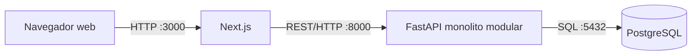
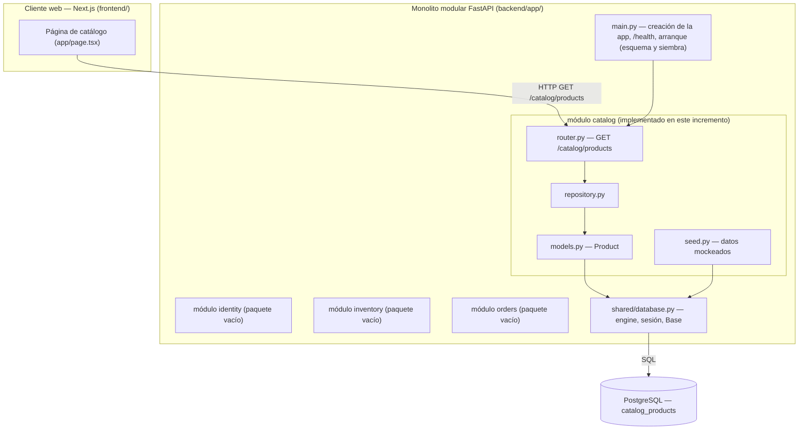
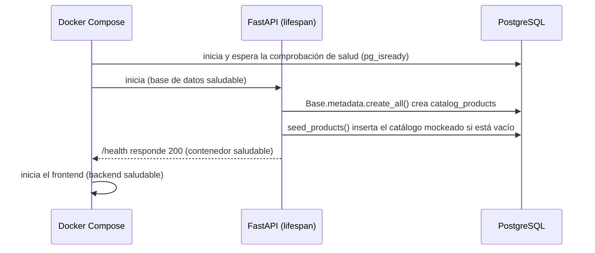
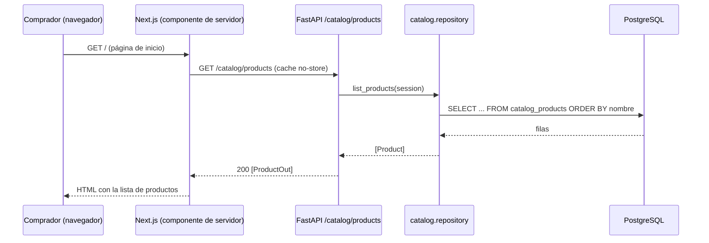
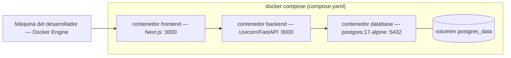

# 

**Acerca de arc42**

arc42, la plantilla para documentar la arquitectura de software y de
sistemas.

Versión de la plantilla 9.0. (basada en la versión AsciiDoc), julio de 2025.

Creada y mantenida por el Dr. Peter Hruschka, el Dr. Gernot Starke y
colaboradores. © arc42. Ver <https://arc42.org>.

# Introducción y Objetivos {#section-introduction-and-goals}

## Descripción de los Requisitos {#_requirements_overview}

Tienda Virtual UTB es un sistema web que centraliza el catálogo y el
proceso básico de compra de la cafetería de la Universidad Tecnológica de
Bolívar. Hoy esta información se gestiona de forma manual y está dispersa,
lo que obliga al comprador a acercarse a un punto de venta para saber si
un producto está disponible.

Dentro del alcance de la fase actual:

- Consultar y buscar en el catálogo de productos.
- Gestionar un carrito de compras.
- Crear y consultar pedidos.
- Administrar el catálogo (productos, precios) por parte del personal
  autorizado.
- Seguimiento básico de inventario (existencias disponibles).

Explícitamente fuera del alcance de esta fase (ver [Restricciones de la
Arquitectura](#section-architecture-constraints)):

- Integración con pasarela de pago en línea — los pedidos se crean en el
  sistema, pero el pago se coordina fuera de él.
- Aplicación móvil nativa.
- Venta de terceros.
- Envíos a nivel nacional.
- Recomendaciones de productos basadas en inteligencia artificial.
- Integración simultánea con varias pasarelas de pago.
- Integración con una fuente de datos real — el sistema funciona sobre
  datos mockeados/sembrados de catálogo, inventario y pedidos, no sobre
  una alimentación en vivo de la cafetería o de la universidad.

## Objetivos de Calidad {#_quality_goals}

| # | Objetivo de calidad | Motivación |
| --- | --- | --- |
| 1 | Seguridad | Solo los usuarios autenticados deben acceder al sistema, y cada rol (comprador, administrador de la tienda, responsable de inventario) solo debe poder ejecutar las operaciones que le corresponden. |
| 2 | Facilidad de uso | Comprar un producto debe tomar pocos pasos; agregar autenticación y verificación de roles no debe convertir el flujo de compra en un proceso tedioso. |
| 3 | Rendimiento | Los cambios de existencias provocados por una compra deben reflejarse con la rapidez suficiente para que dos compradores no crean, ambos, que la misma unidad de un producto agotado está disponible. |
| 4 | Disponibilidad | El catálogo debe permanecer accesible en los momentos de mayor consulta (por ejemplo, la hora de almuerzo), que es cuando se espera que la mayor parte de la comunidad use el sistema. |

Estos cuatro objetivos son los mismos que se desarrollan en el árbol de
utilidad y en los escenarios de calidad (`docs/arbol-utilidad.md` y
`docs/escenarios-calidad.md`).

## Partes Interesadas {#_stakeholders}

| Rol | Quién | Expectativas |
| --- | --- | --- |
| Comprador | Estudiantes, docentes, funcionarios y egresados de la UTB | Saber rápidamente qué hay disponible, comprar en pocos pasos y consultar el estado de su pedido. |
| Administrador de la tienda | Personal autorizado de la cafetería | Registrar/actualizar productos y precios, y gestionar el estado de los pedidos. |
| Responsable de inventario | Personal autorizado de la cafetería | Consultar y actualizar las existencias disponibles para que coincidan con lo que ve el comprador en el catálogo. |

# Restricciones de la Arquitectura {#section-architecture-constraints}

| Restricción | Tipo | Justificación |
| --- | --- | --- |
| Stack fijo: FastAPI (backend), Next.js (frontend), PostgreSQL (base de datos) | Técnica | Decisión temprana del equipo para mantener el mismo stack en todas las entregas del curso y no rediseñar el proyecto en cada evidencia. |
| Solo datos mockeados/sembrados, sin integración real con los sistemas de la cafetería o de la universidad en esta fase | De alcance | Todavía no hay acceso confirmado a un sistema real de inventario/ventas de la cafetería; los datos mockeados permiten validar los flujos de catálogo, carrito e inventario sin depender de esa integración. |
| Sin pasarela de pago en línea en esta fase | De alcance | Aún no se confirma la disponibilidad de una pasarela ni las restricciones institucionales (ver `docs/disponibilidad.md`); se prioriza primero el flujo de catálogo y pedidos. |
| Autenticación propia, sin SSO institucional | Organizacional | A la fecha no se ha confirmado el acceso a la infraestructura de autenticación institucional de la universidad. |
| Entorno de despliegue aún por confirmar | De infraestructura | Depende de cuál servicio gratuito/académico termine siendo autorizado; se deja abierto para que no bloquee el resto de la entrega. |
| Sin aplicación móvil nativa, venta de terceros, envíos nacionales, recomendaciones con IA ni múltiples pasarelas de pago simultáneas | De alcance | Exclusiones explícitas de `docs/problema.md` para mantener un alcance inicial manejable por un equipo de cuatro personas dentro del cronograma del curso. |

# Contexto y Alcance del Sistema {#section-context-and-scope}

## Contexto de Negocio {#_business_context}

Ver el diagrama de contexto C4 en
[`docs/c4/context.md`](../c4/context.md).

- **Comprador** — consulta y busca en el catálogo, gestiona un carrito, y
  crea y consulta sus propios pedidos.
- **Administrador de la tienda** — registra y actualiza productos y
  precios, y gestiona el estado de los pedidos.
- **Responsable de inventario** — consulta y actualiza las existencias
  disponibles.

En esta fase no hay interfaces de dominio externas: todavía no se integra
ninguna pasarela de pago ni sistema de autenticación institucional (ver
Restricciones de la Arquitectura, arriba).

## Contexto Técnico {#_technical_context}

| Canal | Tecnología | Notas |
| --- | --- | --- |
| Cliente web | Next.js | Lo usan compradores, administradores y responsables de inventario mediante vistas según su rol. |
| API | FastAPI (REST sobre HTTP) | Expone al cliente Next.js las operaciones de catálogo, carrito, pedidos e inventario. |
| Almacenamiento de datos | PostgreSQL | Actualmente sembrado con datos mockeados de catálogo, inventario y pedidos; todavía no lo alimenta un sistema real de la cafetería. |

Ningún sistema externo (pasarela de pago, SSO institucional) forma parte
aún del contexto técnico; son puntos de extensión previstos, no
dependencias actuales.

# Estrategia de Solución {#section-solution-strategy}

La solución adopta un **monolito modular** para el backend en FastAPI. Mantiene
simple el despliegue inicial y a la vez hace explícitos los límites entre
identidad, catálogo, inventario y pedidos. La justificación, las alternativas y
las consecuencias quedan registradas en el
[`ADR 0001`](../adr/0001-monolito-modular.md), apoyado en la
[`matriz comparativa de estilos arquitectónicos`](../matriz-comparativa-arquitectura.md).

## Decisiones fundamentales

| Decisión | Enfoque | Contribución |
| --- | --- | --- |
| Estructura del sistema | Un cliente web Next.js y un único backend FastAPI modular, respaldados por una sola instancia de PostgreSQL | Evita el sobrecosto de un sistema distribuido conservando los límites funcionales |
| Descomposición del backend | Paquetes para identidad, catálogo, inventario y pedidos, más un paquete compartido restringido | Alinea el código con las capacidades del negocio y con los límites de rol |
| Comunicación | REST sobre HTTP entre Next.js y FastAPI; interfaces públicas explícitas o eventos internos para la futura colaboración entre módulos | Mantiene comprensible la integración y evita importar los internos de otro módulo |
| Datos | Una instancia de PostgreSQL en la fase actual; la propiedad de los datos se asignará a los módulos al implementar la persistencia | Favorece la consistencia de pedidos y existencias sin distribuir prematuramente |
| Entorno de ejecución | Docker Compose levanta el cliente web, la API y la base de datos como un entorno local reproducible | Reduce las diferencias de configuración entre integrantes del equipo y en las demostraciones |
| Evolución | Mantener un único desplegable hasta que una necesidad medida de escalamiento u organizativa justifique extraer un módulo | Preserva un camino de cambio sin pagar hoy el costo de los microservicios |

## Relación con los objetivos de calidad

- **Seguridad:** identidad y autorización tienen su propio módulo, y los demás
  módulos no deben saltarse su futuro contrato público.
- **Facilidad de uso:** Next.js se mantiene como cliente web independiente para
  que el flujo de compra evolucione sin mezclar la presentación con los módulos
  del backend.
- **Rendimiento:** un único backend y una sola base de datos evitan saltos de
  red en el flujo inicial de actualización de existencias.
- **Disponibilidad:** el arranque con un solo comando y las comprobaciones de
  salud explícitas hacen repetible el entorno académico y de demostración. En
  esta etapa no se declaran garantías de disponibilidad de producción.

## Forma inicial del despliegue

Este incremento agrega, sobre ese esqueleto, un **corte vertical** —
*consultar el catálogo de productos*— implementado de extremo a extremo
(página Next.js a FastAPI `GET /catalog/products`, de ahí a SQLAlchemy y a
PostgreSQL, sembrado con datos mockeados). Los demás módulos (identidad,
inventario y pedidos) siguen siendo paquetes vacíos y se difieren a
incrementos posteriores.

# Vista de Bloques de Construcción {#section-building-block-view}

## Sistema Completo como Caja Blanca {#_whitebox_overall_system}

**Motivación.** La descomposición sigue las capacidades de negocio nombradas en
el `ADR 0001`: la estructura del código refleja identidad, catálogo, inventario
y pedidos, de modo que los módulos que sostendrán los límites de rol son
visibles desde el inicio.

Bloques de construcción contenidos:

| Bloque de construcción | Responsabilidad | Ubicación |
| --- | --- | --- |
| Cliente web | Vista del catálogo renderizada en el servidor; da formato a precios y existencias | `frontend/app/` |
| Punto de entrada de la API | Crea la aplicación FastAPI, expone `/health`, crea el esquema y siembra los datos mockeados al arrancar | `backend/app/main.py` |
| Módulo `catalog` | Es propietario de la tabla `Product` y del endpoint `/catalog/products` | `backend/app/modules/catalog/` |
| Módulos `identity`, `inventory` y `orders` | Paquetes reservados para incrementos posteriores; hoy vacíos | `backend/app/modules/` |
| `shared` | Únicamente acceso transversal a la base de datos (engine, sesión, base declarativa); sin lógica de negocio, según el ADR 0001 | `backend/app/shared/database.py` |
| Base de datos | Instancia única de PostgreSQL; la tabla `catalog_products` es propiedad del módulo `catalog` | contenedor `database` en `compose.yaml` |

Interfaces importantes:

- **`GET /catalog/products`** — devuelve un arreglo JSON de
  `{id, nombre, descripcion, precio_centavos, existencias}` ordenado por
  nombre. Documentado en tiempo de ejecución en `/docs` (OpenAPI).
- **`GET /health`** — sonda de vida usada por la comprobación de salud de
  Docker Compose.

## Nivel 2 {#_level_2}

### Caja Blanca *módulo catalog* {#_white_box_building_block_1}

Es el único módulo con comportamiento en este incremento. Mantiene una
estructura en capas delgada dentro del límite del módulo:

| Elemento | Responsabilidad |
| --- | --- |
| `router.py` | Superficie HTTP: declara `GET /catalog/products`, inyecta una sesión de base de datos con `Depends(get_session)` y transforma las filas a `ProductOut`. |
| `schemas.py` | `ProductOut`, el contrato público de datos del módulo (Pydantic). |
| `repository.py` | `list_products(session)`, el único lugar donde se construyen consultas del catálogo. |
| `models.py` | `Product`, mapeo ORM a `catalog_products`; el módulo es propietario de esta tabla. |
| `seed.py` | `seed_products(session)`, inserción idempotente del catálogo mockeado (solo si la tabla está vacía). |

Aquí se respetan las reglas de dependencia del ADR 0001: el módulo importa de
`app.shared.database` (permitido, por ser transversal) y de nada dentro de
`identity`, `inventory` u `orders`.

### Caja Blanca *shared/database* {#_white_box_building_block_2}

`shared/database.py` expone exactamente tres cosas: `engine`, `SessionLocal`
(a través de la dependencia `get_session`) y `Base`. La URL de la base de datos
proviene de la variable de entorno `DATABASE_URL` (PostgreSQL en Docker
Compose), con un repliegue a una base SQLite en memoria para el conjunto de
pruebas. Aquí no vive ningún modelo ni consulta específica de un módulo.

# Vista de Tiempo de Ejecución {#section-runtime-view}

## Arranque: esquema y siembra {#_runtime_scenario_1}

Aspectos relevantes: la siembra es **idempotente**; al reiniciar con un volumen
existente la tabla ya está poblada y `seed_products` retorna sin escribir. El
orden entre contenedores lo impone Compose con `depends_on` y las
comprobaciones de salud, no una lógica de reintentos en el código.

## Consulta del catálogo {#_runtime_scenario_2}

Aspectos relevantes: la página se renderiza en el servidor, así que el navegador
nunca llama directamente a la API; `cache: "no-store"` vuelve dinámica la ruta,
de modo que los cambios de existencias se reflejan en la siguiente petición. Si
la API no está disponible, la página muestra un mensaje de error en lugar de
fallar toda la respuesta.

# Vista de Despliegue {#section-deployment-view}

## Infraestructura Nivel 1 {#_infrastructure_level_1}

**Motivación.** Un solo `docker compose up --build` debe levantar todo el
sistema de forma reproducible en la máquina de cualquier integrante, para
desarrollo y demostraciones. Todavía no se compromete ningún entorno en la nube
(ver Restricciones de la Arquitectura).

Correspondencia entre bloques de construcción e infraestructura:

| Bloque de construcción | Contenedor | Imagen o construcción | Puertos |
| --- | --- | --- | --- |
| Cliente web | `frontend` | construye `./frontend` (node:22-alpine) | 3000 |
| API (monolito modular) | `backend` | construye `./backend` (python:3.12-slim) | 8000 |
| Base de datos | `database` | `postgres:17-alpine` | 5432 (interno) |
| Datos persistentes | volumen `postgres_data` | — | — |

Características de calidad: las comprobaciones de salud de `database`
(`pg_isready`) y de `backend` (`/health`), junto con
`depends_on: condition: service_healthy`, garantizan el orden de arranque; el
volumen con nombre conserva los datos locales entre reinicios.

# Conceptos Transversales {#section-concepts}

## Persistencia y propiedad de los datos {#_concept_1}

Una instancia de PostgreSQL y una sola `Base` de SQLAlchemy. Cada módulo declara
y es propietario de sus tablas (`catalog` es propietario de `catalog_products`);
los demás módulos deben pasar por la interfaz pública del módulo propietario,
nunca por sus modelos ORM. El esquema se crea al arrancar con `create_all`; las
migraciones (Alembic) se difieren hasta que el esquema se estabilice.

## Configuración {#_concept_2}

La configuración se lee de variables de entorno definidas en `compose.yaml`
(`DATABASE_URL` para la API y `API_URL` para el cliente web). El código trae
valores por defecto seguros para el entorno local, de modo que el conjunto de
pruebas se ejecuta sin configurar nada.

## Datos mockeados {#_concept_3}

Según las restricciones, no existe una fuente de datos real. Los datos de
siembra viven en el módulo propietario (`catalog/seed.py`) y se insertan de
forma idempotente al arrancar, así el sistema en ejecución siempre tiene un
catálogo que mostrar sin ningún paso manual.

## Pruebas {#_concept_4}

Las pruebas se ejecutan contra SQLite en memoria (sin necesidad de
contenedores) y cubren la ruta de salud, los límites entre módulos del ADR y el
endpoint del catálogo (contrato, orden y contenido sembrado). GitHub Actions
ejecuta el mismo conjunto en cada envío y en cada solicitud de cambios.

# Decisiones de Arquitectura {#section-design-decisions}

| ADR | Decisión | Estado |
| --- | --- | --- |
| [0001](../adr/0001-monolito-modular.md) | Monolito modular para el backend FastAPI, dividido en `identity`, `catalog`, `inventory` y `orders`, más un paquete `shared` restringido, con reglas explícitas de dependencia entre módulos | Aceptada (2026-08-21) |

Decisiones aún abiertas (candidatas a futuros ADR): el mecanismo de
autenticación, la adopción de migraciones de base de datos, si algún módulo
adopta internamente una forma hexagonal, y el destino de despliegue.

# Requisitos de Calidad {#section-quality-scenarios}

## Resumen de Requisitos de Calidad {#_quality_requirements_overview}

El árbol de utilidad (`docs/arbol-utilidad.md`) prioriza las hojas en dos ejes:
impacto en el negocio (IN) y riesgo arquitectónico (RA). Las hojas de mayor
prioridad (IN alto) son la autorización por rol, el flujo de compra en el
mínimo número de pasos, y que las existencias se vuelvan visibles para otros
usuarios poco después de un pedido.

## Escenarios de Calidad {#_quality_scenarios}

Los escenarios completos (Fuente / Estímulo / Ambiente / Artefacto / Respuesta /
Medida de respuesta) están en `docs/escenarios-calidad.md`. Resumen:

| # | Objetivo de calidad | Escenario | Medida de respuesta | Cubierto en este incremento |
| --- | --- | --- | --- | --- |
| 1 | Seguridad | Un responsable de inventario intenta cambiar el precio de un producto | El 100% de las operaciones fuera de rol definidas se rechazan (403) | No; requiere el módulo `identity` |
| 2 | Facilidad de uso | Un comprador completa una compra | Flujo completado en 4 pantallas o pasos como máximo | Parcialmente; existe la vista de catálogo, faltan carrito y confirmación |
| 3 | Rendimiento | Un pedido reduce las existencias de un producto | Cambio visible para otra sesión en menos de 2 s al recargar | Habilitador en su lugar: lectura dinámica del catálogo (`no-store`); flujo de pedidos pendiente |
| 4 | Disponibilidad | Unos 5 compradores consultan el catálogo a la vez | Todos obtienen una respuesta correcta y el servidor local no se cae | Verificable ya: `GET /catalog/products` está en funcionamiento |

# Riesgos y Deuda Técnica {#section-technical-risks}

| Riesgo o deuda | Impacto | Mitigación actual |
| --- | --- | --- |
| Los límites entre módulos son una convención, no están impuestos por la red | Acoplamiento indeseado entre módulos | Reglas de dependencia del ADR y `test_architecture.py`; se prevé una prueba de dependencias más estricta cuando exista más código |
| `create_all` en lugar de migraciones | Los cambios de esquema sobre bases de datos pobladas serán manuales | Aceptable mientras el esquema sea pequeño; ADR de Alembic pendiente |
| Destino de despliegue sin elegir | No se puede demostrar fuera de una máquina local | El sistema funciona por completo con un solo comando de Compose; destino por confirmar (`docs/disponibilidad.md`) |
| Solo datos mockeados | El comportamiento no se valida contra datos reales de la cafetería | Restricción explícita de alcance; los datos sembrados modelan productos realistas |
| La versión fijada de Next.js (`15.5.2`) no es la última publicada | Posible exposición a fallos ya corregidos aguas arriba | Registrado como tarea de seguimiento: revisar los avisos de seguridad vigentes y actualizar Next.js antes de cualquier despliegue real |

# Glosario {#section-glossary}

| Término | Definición |
| --- | --- |
| Comprador | Estudiante, docente, funcionario o egresado de la UTB que consulta el catálogo y realiza o consulta pedidos. |
| Administrador de la tienda | Personal autorizado de la cafetería que gestiona productos, precios y el estado de los pedidos. |
| Responsable de inventario | Personal autorizado de la cafetería que consulta y actualiza las existencias disponibles. |
| Catálogo | Conjunto de productos ofrecidos por la cafetería, con descripción, precio y existencias disponibles. |
| Monolito modular | Un único backend desplegable dividido en módulos con límites explícitos por capacidad de negocio (ver ADR 0001). |
| Módulo | Paquete del backend correspondiente a una capacidad de negocio (`identity`, `catalog`, `inventory`, `orders`); es propietario de sus tablas y de su contrato público. |
| `shared` | Paquete reservado únicamente para código realmente transversal (hoy, el acceso a la base de datos); nunca es el lugar para la lógica de un módulo. |
| Corte vertical | Una sola funcionalidad implementada a través de todas las capas (web, API y persistencia) en lugar de una capa a la vez. |
| Datos sembrados o mockeados | Datos de ejemplo insertados automáticamente para que el sistema sea utilizable sin una integración real. |
| `precio_centavos` | Precio del producto almacenado como número entero de centavos (COP) para evitar errores de redondeo de punto flotante. |
| ADR | *Architecture Decision Record*, o registro de decisión de arquitectura: documento breve que registra una decisión, su contexto y sus consecuencias. |
| C4 | Modelo para visualizar la arquitectura de software en cuatro niveles de acercamiento: Contexto, Contenedores, Componentes y Código. |
| Comprobación de salud | Endpoint `GET /health` que Docker Compose usa para decidir cuándo un contenedor está listo. |
