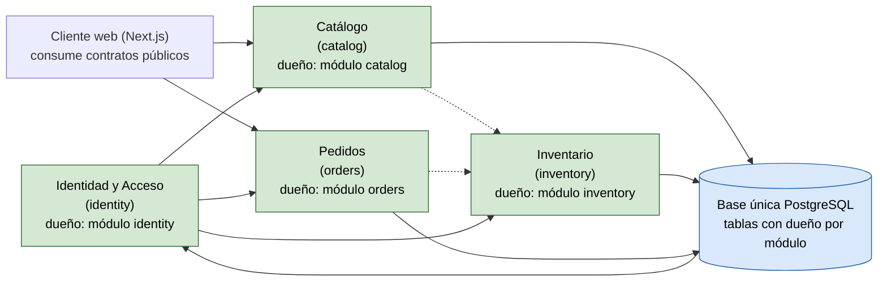

# Mapa de contextos (bounded contexts) — Tienda Virtual UTB

> **Tipo:** mapa de contextos delimitados (estilo DDD). **Autor:** Equipo Tienda
> Virtual UTB. **Fecha:** 2026-09-06. **Notación:** context mapping con Mermaid
> (`flowchart LR`) inspirado en *Domain-Driven Design Distilled* (Vaughn Vernon).
> **Trazabilidad:** [`docs/adr/0001-monolito-modular.md`](adr/0001-monolito-modular.md),
> [`docs/arc42/arc42-template-EN.md`](arc42/arc42-template-EN.md) y
> [`docs/c4/container.md`](c4/container.md).

## Qué es este mapa

El sistema se organiza en **módulos que reflejan capacidades del negocio**
(identidad, catálogo, inventario y pedidos), como decidió el
[ADR 0001](adr/0001-monolito-modular.md). Este documento reinterpreta esas
capacidades como **contextos delimitados** (bounded contexts): dominio + su
lenguaje ubicuo + sus datos (con dueño único), y dibuja cómo se relacionan.

El propósito es hacer explícito **quién es dueño de qué** y dónde están los
puntos de integración, de modo que las reglas de dependencia del ADR y la prueba
`test_architecture.py` tengan una base conceptual clara.

Los métodos de colaboración entre contextos (upstream/downstream, customer /
supplier, conformist, etc.) se usan aquí en su sentido simple: indicar **de
quién depende quién** y qué contrato público es la fuente de verdad.

## Diagrama de contextos delimitados

> _Fig. 1 — Mapa de contextos delimitados de la Tienda Virtual UTB (flowchart)._
> Flecha sólida `A --> B` = A consume el contrato público de B. Flecha punteada
> `.->` = colaboración prevista para un incremento futuro. `catalog` e
> `inventory` implementan lectura; identidad y pedidos siguen pendientes. La
> única persistencia es la base PostgreSQL compartida;
> el dueño de cada tabla se lista en la tabla de módulos.

### Lectura del mapa

- **Identidad y Acceso** es el contexto **upstream** de todos los demás en
  materia de autenticación y autorización por rol: los otros contextos consumen
  su contrato público y **no pueden eludirlo** (escenario de seguridad 1).
- **Catálogo e Inventario** comparten la existencia de un producto, pero son
  responsabilidades de negocio distintas: el catálogo describe el producto
  (nombre, descripción, precio) y el inventario posee la cantidad disponible
  (`existencias`). Por dueño único, la tabla de existencias pertenece al
  contexto **Inventario**, no al Catálogo (ver violación V1 en
  [`docs/violaciones-s6.md`](violaciones-s6.md)).
- **Pedidos** es el consumidor natural de Inventario y Catálogo; su creación
  reduce existencias en el mismo proceso/transacción (escenario de rendimiento 3).
- **Cliente web (Next.js)** no es un contexto de dominio: es la interfaz que
  consume los contratos públicos de los módulos del backend.

## Tabla de módulos con dueño único

Cada módulo del backend es un contexto delimitado. La columna **Dueño (rol)** es
el responsable de negocio de ese contexto (según `docs/problema.md` y la
sección *Stakeholders* de arc42), no un integrante del equipo. La columna
**Tablas que posee** refleja el dueño único de los datos; **Tabla hoy** indica
el estado real del código (las discrepancias son violaciones listadas en
`docs/violaciones-s6.md`).

**Leyenda de la columna Estado:** `IMPLEMENTADO` = tiene comportamiento en el
incremento actual; `VACÍO` = paquete reservado, sin lógica todavía.

| Contexto delimitado | Módulo | Dueño (rol) | Tablas que posee (objetivo) | Tabla hoy (real) | Contrato público | Estado |
|---|---|---|---|---|---|---|
| Identidad y Acceso | `backend/app/modules/identity/` | Sistema (auth propia) / rol de admin | `users`, `roles`, `sessions` (prevista) | — (no existe) | Autenticación y autorización por rol; aún sin exponer | VACÍO |
| Catálogo | `backend/app/modules/catalog/` | Administrador de la tienda | `catalog_products` (nombre, descripción, precio) | `catalog_products` sin existencias | `GET /catalog/products` → `ProductOut` | IMPLEMENTADO |
| Inventario | `backend/app/modules/inventory/` | Responsable de inventario | `inventory_stock` (`product_id`, `existencias`) | `inventory_stock` | `GET /inventory` → `StockOut` | IMPLEMENTADO (lectura) |
| Pedidos | `backend/app/modules/orders/` | Administrador de la tienda / comprador | `orders`, `order_items` (prevista) | — (no existe) | Por definir (futuro) | VACÍO |

- **Base de datos:** única instancia PostgreSQL compartida (`catalog_products`
  e `inventory_stock`), cada una propiedad de su contexto. Los demás contextos
  acceden vía contrato público, nunca por ORM (ADR 0001).
- **`shared/database.py`:** elemento transversal, no un contexto: expone
  `engine`, `get_session` y `Base`, sin lógica de negocio.

## Lenguaje ubicuo por contexto

| Contexto delimitado | Términos propios |
|---|---|
| Identidad y Acceso | usuario, rol, comprador, administrador de la tienda, responsable de inventario, autenticación, autorización |
| Catálogo | producto, nombre, descripción, precio (`precio_centavos`), disponibilidad visible |
| Inventario | existencias (`existencias`), stock disponible, reducción de existencias |
| Pedidos | carrito, pedido (`order`), ítem de pedido (`order_item`), confirmación de pedido, estado del pedido |

## Referencias

- Reglas de dependencia: [`ADR 0001`](adr/0001-monolito-modular.md).
- Diagramas del sistema: [`C4`](c4/context.md) y [`C4 contenedores`](c4/container.md).
- Descomposición de bloques: arc42, sección *Building Block View* (`docs/arc42/arc42-template-EN.md`).
- Roles: [`docs/problema.md`](problema.md) y arc42, sección *Stakeholders*.
