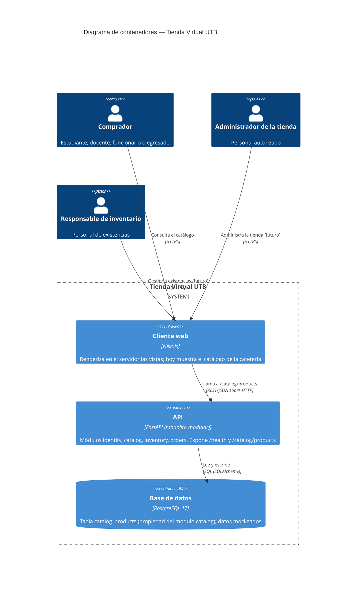

# C4 — Contenedores (Nivel 2)

Unidades desplegables de la Tienda Virtual UTB y su comunicación. Se
corresponden una a una con los servicios de `compose.yaml`. En esta fase no hay
sistemas externos (sin pasarela de pago ni SSO institucional; ver
`docs/c4/context.md` y la sección *Architecture Constraints* de
`docs/arc42/arc42-template-EN.md`).

## Notas

- **Cliente web (Next.js, :3000).** Componentes de servidor; la petición al
  catálogo se hace desde el servidor de Next.js hacia la API (`API_URL`), no
  desde el navegador.
- **API (FastAPI, :8000).** Un único proceso. En el arranque crea el esquema y
  siembra el catálogo mockeado de forma idempotente (ver *Runtime View* en
  arc42). Solo el módulo `catalog` tiene comportamiento en este incremento.
- **Base de datos (PostgreSQL, :5432 interno).** Instancia única con un volumen
  `postgres_data` que conserva los datos entre reinicios.
- El nivel 3 (componentes de la API) se documenta como *Building Block View
  nivel 2* en `docs/arc42/arc42-template-EN.md`.
