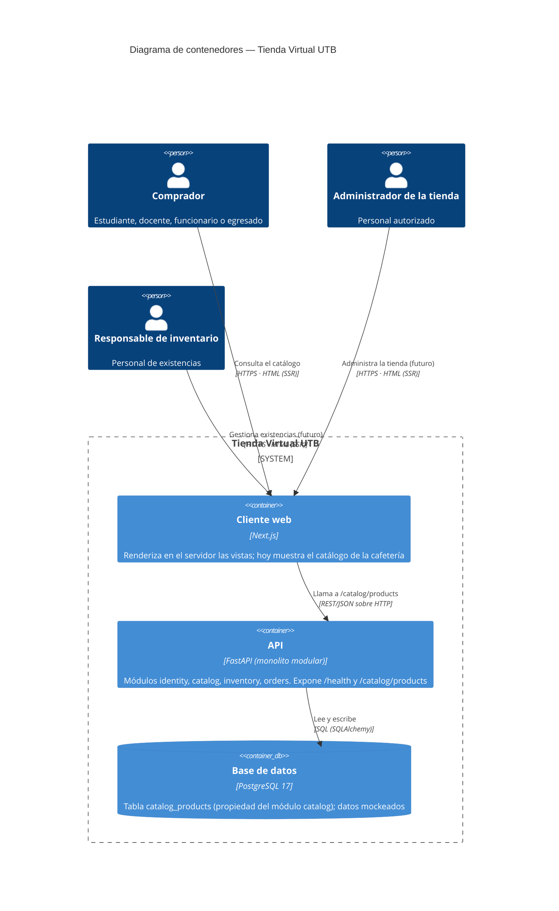

# C4 — Contenedores (Nivel 2)

> **Tipo:** diagrama de contenedores (C4 nivel 2). **Autor:** Equipo Tienda
> Virtual UTB. **Fecha:** 2026-08-31. **Notación:** C4 model
> (<https://c4model.com>), renderizado con Mermaid `C4Container`.
> **Trazabilidad:** `docs/adr/0001-monolito-modular.md` e historial de git.

Unidades desplegables de la Tienda Virtual UTB y su comunicación. Se
corresponden una a una con los servicios de `compose.yaml`. En esta fase no hay
sistemas externos (sin pasarela de pago ni SSO institucional; ver
`docs/c4/context.md` y la sección *Architecture Constraints* de
`docs/arc42/arc42-template-EN.md`).

```mermaid
C4Container
    title Diagrama de contenedores — Tienda Virtual UTB

    Person(comprador, "Comprador", "Estudiante, docente, funcionario o egresado")
    Person(admin, "Administrador de la tienda", "Personal autorizado")
    Person(inventario, "Responsable de inventario", "Personal de existencias")

    System_Boundary(sistema, "Tienda Virtual UTB") {
        Container(web, "Cliente web", "Next.js", "Renderiza en el servidor las vistas; hoy muestra el catálogo de la cafetería")
        Container(api, "API", "FastAPI (monolito modular)", "Módulos identity, catalog, inventory, orders. Expone /health y /catalog/products")
        ContainerDb(db, "Base de datos", "PostgreSQL 17", "Tabla catalog_products (propiedad del módulo catalog); datos mockeados")
    }

    Rel(comprador, web, "Consulta el catálogo", "HTTPS · HTML (SSR)")
    Rel(admin, web, "Administra la tienda (futuro)", "HTTPS · HTML (SSR)")
    Rel(inventario, web, "Gestiona existencias (futuro)", "HTTPS · HTML (SSR)")
    Rel(web, api, "Llama a /catalog/products", "REST/JSON sobre HTTP")
    Rel(api, db, "Lee y escribe", "SQL (SQLAlchemy)")
```

## Notas

- **Leyenda.** `Person` = rol humano. `Container` = unidad desplegable/ejecutable
  por separado (no un contenedor Docker necesariamente); `ContainerDb` = almacén
  de datos. Cada flecha es una relación unidireccional etiquetada con propósito y
  protocolo. Las relaciones marcadas *(futuro)* corresponden a roles cuyo flujo
  aún no está implementado.
- **Alcance del diagrama.** Solo unidades desplegables y su comunicación; la
  estructura interna de la API (componentes) se documenta en arc42 (*Building
  Block View, Level 2*), no aquí.
- **Cliente web (Next.js, :3000).** Componentes de servidor; la petición al
  catálogo se hace desde el servidor de Next.js hacia la API (`API_URL`), no
  desde el navegador.
- **API (FastAPI, :8000).** Un único proceso. En el arranque crea el esquema y
  siembra el catálogo mockeado de forma idempotente (ver *Runtime View*
  en arc42). Solo el módulo `catalog` tiene comportamiento en este incremento.
- **Base de datos (PostgreSQL, :5432 interno).** Instancia única con un volumen
  `postgres_data` que conserva los datos entre reinicios.
- El nivel 3 (componentes de la API) se documenta como *Building Block View,
  Level 2* en `docs/arc42/arc42-template-EN.md`.
- **Despliegue público (S8):** las mismas tres unidades corren en Vercel
  (cliente web), Render (API como contenedor Docker, `render.yaml`) y Neon
  (PostgreSQL gestionado), con UptimeRobot como monitor externo. El diagrama
  de despliegue público está en arc42 §7, figura 7.2, y las decisiones por
  pieza en los ADR [0003](../adr/0003-frontend-vercel.md),
  [0004](../adr/0004-api-contenedor-render.md) y
  [0005](../adr/0005-postgres-neon.md).
