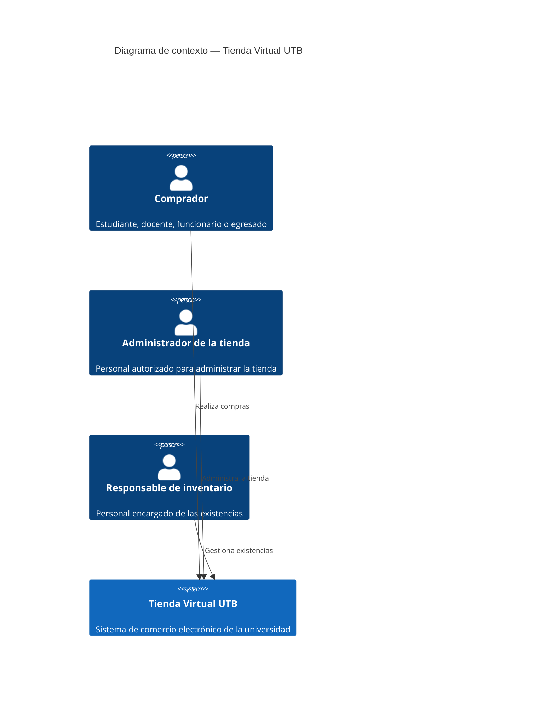

# C4 — Contexto (Nivel 1)

> **Tipo:** diagrama de contexto del sistema (C4 nivel 1). **Autor:** Equipo Tienda Virtual UTB. **Fecha:** 2026-08-31. **Notación:** C4 model (<https://c4model.com>), renderizado con Mermaid `C4Context`. **Trazabilidad:** `docs/adr/0001-monolito-modular.md` e historial de git.

Actores y su interacción con el sistema Tienda Virtual UTB. En esta
fase el sistema no depende de ningún sistema externo: la
autenticación es propia (no hay SSO institucional integrado) y no hay
pasarela de pago en el alcance (ver `docs/arc42/arc42-template-EN.md`,
sección *Architecture Constraints*, y `docs/problema.md`).

## Notas

- **Leyenda.** `Person` = rol humano (no un cargo). La caja resaltada (*Tienda Virtual UTB*) es el sistema en alcance. Cada flecha es una relación unidireccional etiquetada con su propósito; en el nivel 1 no se especifica protocolo (eso aparece desde el nivel 2, ver `container.md`).
- **Alcance del diagrama.** Muestra únicamente actores y frontera del sistema; ninguna estructura interna (contenedores, base de datos) aparece aquí; ver `docs/c4/container.md`.
- **Pasarela de pago** y **SSO institucional** quedan fuera de este
  contexto por decisión de alcance de esta entrega; se consideran
  extensiones futuras, no dependencias actuales.
- El sistema opera sobre datos mockeados/seed (catálogo, existencias y
  pedidos de ejemplo), no sobre una integración real con la
  cafetería o la universidad.
