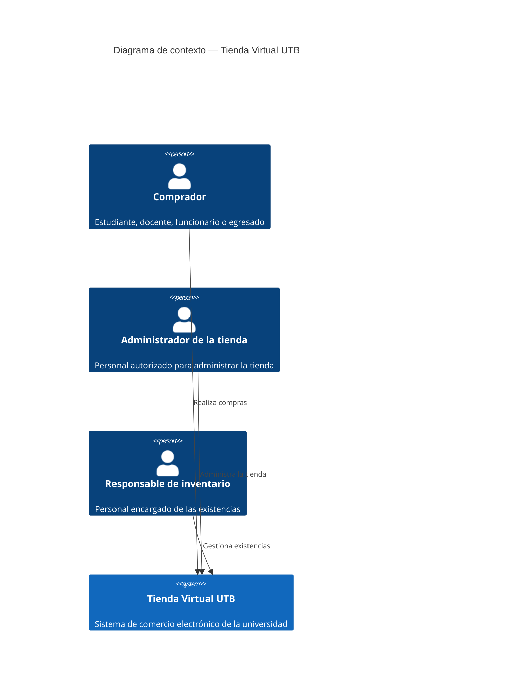

# C4 — Contexto (Nivel 1)

Actores y su interacción con el sistema Tienda Virtual UTB. En esta
fase el sistema no depende de ningún sistema externo: la
autenticación es propia (no hay SSO institucional integrado) y no hay
pasarela de pago en el alcance (ver `docs/arc42/arc42-template-EN.md`,
sección *Architecture Constraints*, y `docs/problema.md`).

## Notas

- **Pasarela de pago** y **SSO institucional** quedan fuera de este
  contexto por decisión de alcance de esta entrega; se consideran
  extensiones futuras, no dependencias actuales.
- El sistema opera sobre datos mockeados/seed (catálogo, existencias y
  pedidos de ejemplo), no sobre una integración real con la
  cafetería o la universidad.
